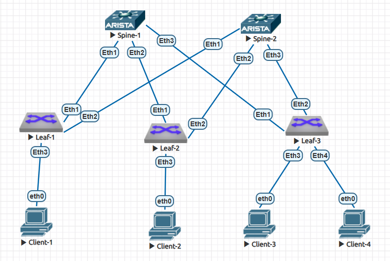

# Лабораторная работа: Настройка OSPF в Underlay сети Clos-топологии

## **Часть 2: Настройка OSPF для Underlay сети**

### **Цель работы**
Настроить протокол динамической маршрутизации OSPF в Underlay сети для обеспечения IP-связанности между всеми сетевыми устройствами Clos-топологии.

### **Топология сети**


### **Схема IP-адресации (повторение для справки)**

#### **Loopback интерфейсы (Router ID):**
- `spine-1`: 10.0.0.1/32
- `spine-2`: 10.0.0.2/32
- `leaf-1`: 10.0.1.1/32
- `leaf-2`: 10.0.2.1/32
- `leaf-3`: 10.0.3.1/32

#### **Spine-Leaf линки (/31):**
```
spine-1 <-> leaf-1: 10.1.1.0/31 (spine .0, leaf .1)
spine-1 <-> leaf-2: 10.1.2.0/31
spine-1 <-> leaf-3: 10.1.3.0/31

spine-2 <-> leaf-1: 10.2.1.0/31
spine-2 <-> leaf-2: 10.2.2.0/31
spine-2 <-> leaf-3: 10.2.3.0/31
```

### **План настройки OSPF**

1. **Базовая настройка OSPF на всех устройствах**
   - Настройка Router ID из Loopback интерфейсов
   - Настройка всех устройств в Area 0 (backbone area)
   - Активация OSPF на соответствующих интерфейсах

2. **Оптимизация конфигурации OSPF**
   - Настройка интерфейсов spine-leaf как point-to-point
   - Пассивные интерфейсы для Loopback и Management
   - Настройка максимального числа LSA

3. **Верификация работы OSPF**
   - Проверка установления соседства (adjacency)
   - Проверка таблицы маршрутизации OSPF
   - Тестирование связности между Loopback интерфейсами

## **Конфигурация OSPF на устройствах**

### **1. SPINE-1 конфигурация OSPF**

```bash
router ospf 1
   router-id 10.0.0.1
   passive-interface default
   no passive-interface Ethernet1
   no passive-interface Ethernet2
   no passive-interface Ethernet3
   max-lsa 12000
!
interface Ethernet1
   ip ospf network point-to-point
   ip ospf area 0.0.0.0
!
interface Ethernet2
   ip ospf network point-to-point
   ip ospf area 0.0.0.0
!
interface Ethernet3
   ip ospf network point-to-point
   ip ospf area 0.0.0.0
!
interface Loopback0
   ip ospf area 0.0.0.0
```

### **2. SPINE-2 конфигурация OSPF**

```bash
router ospf 1
   router-id 10.0.0.2
   passive-interface default
   no passive-interface Ethernet1
   no passive-interface Ethernet2
   no passive-interface Ethernet3
   max-lsa 12000
!
interface Ethernet1
   ip ospf network point-to-point
   ip ospf area 0.0.0.0
!
interface Ethernet2
   ip ospf network point-to-point
   ip ospf area 0.0.0.0
!
interface Ethernet3
   ip ospf network point-to-point
   ip ospf area 0.0.0.0
!
interface Loopback0
   ip ospf area 0.0.0.0
```

### **3. LEAF-1 конфигурация OSPF**

```bash
router ospf 1
   router-id 10.0.1.1
   passive-interface default
   no passive-interface Ethernet1
   no passive-interface Ethernet2
   max-lsa 12000
!
interface Ethernet1
   ip ospf network point-to-point
   ip ospf area 0.0.0.0
!
interface Ethernet2
   ip ospf network point-to-point
   ip ospf area 0.0.0.0
!
interface Loopback0
   ip ospf area 0.0.0.0
```

### **4. LEAF-2 конфигурация OSPF**

```bash
router ospf 1
   router-id 10.0.2.1
   passive-interface default
   no passive-interface Ethernet1
   no passive-interface Ethernet2
   max-lsa 12000
!
interface Ethernet1
   ip ospf network point-to-point
   ip ospf area 0.0.0.0
!
interface Ethernet2
   ip ospf network point-to-point
   ip ospf area 0.0.0.0
!
interface Loopback0
   ip ospf area 0.0.0.0
```

### **5. LEAF-3 конфигурация OSPF**

```bash
router ospf 1
   router-id 10.0.3.1
   passive-interface default
   no passive-interface Ethernet1
   no passive-interface Ethernet2
   max-lsa 12000
!
interface Ethernet1
   ip ospf network point-to-point
   ip ospf area 0.0.0.0
!
interface Ethernet2
   ip ospf network point-to-point
   ip ospf area 0.0.0.0
!
interface Loopback0
   ip ospf area 0.0.0.0
```

## **Диагностика и проверка OSPF**

### **1. Проверка соседств OSPF на spine-1**

```bash
spine-1#show ip ospf neighbor
Neighbor ID     Instance VRF      Pri State                  Dead Time   Address         Interface
10.0.1.1        1        default  0   FULL                   00:00:34    10.1.1.1        Ethernet1
10.0.2.1        1        default  0   FULL                   00:00:35    10.1.2.1        Ethernet2
10.0.3.1        1        default  0   FULL                   00:00:38    10.1.3.1        Ethernet3
```

**Результат:** Spine-1 установил FULL соседство со всеми тремя leaf коммутаторами.

### **2. Проверка соседств OSPF на spine-2**

```bash
spine-2#show ip ospf neighbor
Neighbor ID     Instance VRF      Pri State                  Dead Time   Address         Interface
10.0.1.1        1        default  0   FULL                   00:00:34    10.2.1.1        Ethernet1
10.0.2.1        1        default  0   FULL                   00:00:37    10.2.2.1        Ethernet2
10.0.3.1        1        default  0   FULL                   00:00:38    10.2.3.1        Ethernet3
```

**Результат:** Spine-2 установил FULL соседство со всеми тремя leaf коммутаторами.

### **3. Проверка таблицы маршрутизации OSPF на leaf-1**

```bash
leaf-1#show ip route ospf

VRF: default
Codes: C - connected, S - static, K - kernel,
       O - OSPF, IA - OSPF inter area, E1 - OSPF external type 1,
       E2 - OSPF external type 2, N1 - OSPF NSSA external type 1,
       N2 - OSPF NSSA external type2, B - Other BGP Routes,
       B I - iBGP, B E - eBGP, R - RIP, I L1 - IS-IS level 1,
       I L2 - IS-IS level 2, O3 - OSPFv3, A B - BGP Aggregate,
       A O - OSPF Summary, NG - Nexthop Group Static Route,
       V - VXLAN Control Service, M - Martian,
       DH - DHCP client installed default route,
       DP - Dynamic Policy Route, L - VRF Leaked,
       G  - gRIBI, RC - Route Cache Route

 O        10.0.0.1/32 [110/20] via 10.1.1.0, Ethernet1
 O        10.0.0.2/32 [110/20] via 10.2.1.0, Ethernet2
 O        10.0.2.1/32 [110/30] via 10.1.1.0, Ethernet1
                               via 10.2.1.0, Ethernet2
 O        10.0.3.1/32 [110/30] via 10.1.1.0, Ethernet1
                               via 10.2.1.0, Ethernet2
 O        10.1.2.0/31 [110/20] via 10.1.1.0, Ethernet1
 O        10.1.3.0/31 [110/20] via 10.1.1.0, Ethernet1
 O        10.2.2.0/31 [110/20] via 10.2.1.0, Ethernet2
 O        10.2.3.0/31 [110/20] via 10.2.1.0, Ethernet2
```

**Результат:** Leaf-1 узнал через OSPF маршруты ко всем Loopback интерфейсам и spine-leaf сетям. Наблюдается **ECMP (Equal-Cost Multi-Path) для маршрутов до других leaf устройств**.

### **4. Проверка связности между Loopback интерфейсами**

#### **4.1 Проверка с leaf-1 до spine-1 (10.0.0.1)**

```bash
leaf-1#ping 10.0.0.1 source 10.0.1.1
PING 10.0.0.1 (10.0.0.1) from 10.0.1.1 : 72(100) bytes of data.
80 bytes from 10.0.0.1: icmp_seq=1 ttl=64 time=11.8 ms
80 bytes from 10.0.0.1: icmp_seq=2 ttl=64 time=7.96 ms
80 bytes from 10.0.0.1: icmp_seq=3 ttl=64 time=7.66 ms
80 bytes from 10.0.0.1: icmp_seq=4 ttl=64 time=9.77 ms
80 bytes from 10.0.0.1: icmp_seq=5 ttl=64 time=12.0 ms

--- 10.0.0.1 ping statistics ---
5 packets transmitted, 5 received, 0% packet loss, time 55ms
rtt min/avg/max/mdev = 7.665/9.862/12.064/1.858 ms, ipg/ewma 13.813/10.922 ms
```

#### **4.2 Проверка с leaf-1 до leaf-2 (10.0.2.1)**

```bash
leaf-1#ping 10.0.2.1 source 10.0.1.1
PING 10.0.2.1 (10.0.2.1) from 10.0.1.1 : 72(100) bytes of data.
80 bytes from 10.0.2.1: icmp_seq=1 ttl=63 time=28.6 ms
80 bytes from 10.0.2.1: icmp_seq=2 ttl=63 time=24.3 ms
80 bytes from 10.0.2.1: icmp_seq=3 ttl=63 time=16.2 ms
80 bytes from 10.0.2.1: icmp_seq=4 ttl=63 time=19.7 ms
80 bytes from 10.0.2.1: icmp_seq=5 ttl=63 time=19.3 ms

--- 10.0.2.1 ping statistics ---
5 packets transmitted, 5 received, 0% packet loss, time 96ms
rtt min/avg/max/mdev = 16.271/21.663/28.620/4.338 ms, pipe 2, ipg/ewma 24.033/24.947 ms
```

#### **4.3 Проверка с leaf-1 до leaf-3 (10.0.3.1)**

```bash
leaf-1#ping 10.0.3.1 source 10.0.1.1
PING 10.0.3.1 (10.0.3.1) from 10.0.1.1 : 72(100) bytes of data.
80 bytes from 10.0.3.1: icmp_seq=1 ttl=63 time=32.4 ms
80 bytes from 10.0.3.1: icmp_seq=2 ttl=63 time=26.0 ms
80 bytes from 10.0.3.1: icmp_seq=3 ttl=63 time=26.5 ms
80 bytes from 10.0.3.1: icmp_seq=4 ttl=63 time=27.6 ms
80 bytes from 10.0.3.1: icmp_seq=5 ttl=63 time=19.4 ms

--- 10.0.3.1 ping statistics ---
5 packets transmitted, 5 received, 0% packet loss, time 94ms
rtt min/avg/max/mdev = 19.410/26.422/32.421/4.169 ms, pipe 3, ipg/ewma 23.570/29.180 ms
```

### **5. Проверка OSPF интерфейсов на leaf-2**

```bash
leaf-2#show ip ospf interface brief
   Interface          Instance VRF        Area            IP Address         Cost  State      Nbrs
   Lo0                1        default    0.0.0.0         10.0.2.1/32        10    DR         0
   Et1                1        default    0.0.0.0         10.1.2.1/31        10    P2P        1
   Et2                1        default    0.0.0.0         10.2.2.1/31        10    P2P        1
```

**Результат:** Все интерфейсы OSPF находятся в рабочем состоянии, установлены соседства.

### **6. Проверка OSPF базы данных на spine-1**

```bash
spine-1#show ip ospf database

            OSPF Router with ID(10.0.0.1) (Instance ID 1) (VRF default)


                 Router Link States (Area 0.0.0.0)

Link ID         ADV Router      Age         Seq#         Checksum Link count
10.0.3.1        10.0.3.1        90          0x80000030   0xe930   5
10.0.2.1        10.0.2.1        78          0x80000026   0x5fcb   5
10.0.0.2        10.0.0.2        41          0x80000036   0xa51b   7
10.0.0.1        10.0.0.1        114         0x8000003d   0x645e   7
10.0.1.1        10.0.1.1        85          0x80000032   0xae77   5
```

**Результат:** База данных OSPF содержит информацию от всех пяти маршрутизаторов в топологии.

### **7. Детальная проверка ECMP**

#### **7.1 Проверка маршрута с ECMP**

```bash
leaf-1#show ip route 10.0.2.1

VRF: default
Codes: C - connected, S - static, K - kernel,
       O - OSPF, IA - OSPF inter area, E1 - OSPF external type 1,
       E2 - OSPF external type 2, N1 - OSPF NSSA external type 1,
       N2 - OSPF NSSA external type2, B - Other BGP Routes,
       B I - iBGP, B E - eBGP, R - RIP, I L1 - IS-IS level 1,
       I L2 - IS-IS level 2, O3 - OSPFv3, A B - BGP Aggregate,
       A O - OSPF Summary, NG - Nexthop Group Static Route,
       V - VXLAN Control Service, M - Martian,
       DH - DHCP client installed default route,
       DP - Dynamic Policy Route, L - VRF Leaked,
       G  - gRIBI, RC - Route Cache Route

 O        10.0.2.1/32 [110/30] via 10.1.1.0, Ethernet1
                               via 10.2.1.0, Ethernet2
```

**Результат:** Маршрут до leaf-2 имеет два равнозначных next-hop через оба spine коммутатора, что подтверждает работу ECMP.

#### **7.2 Трассировка маршрута**

```bash
leaf-1#traceroute 10.0.2.1 source 10.0.1.1
traceroute to 10.0.2.1 (10.0.2.1), 30 hops max, 60 byte packets
 1  10.1.1.0 (10.1.1.0)  36.139 ms  41.731 ms  65.672 ms
 2  10.0.2.1 (10.0.2.1)  73.498 ms  85.334 ms  93.307 ms
```

**Результат:** Traceroute показывает путь через spine-1. При реальной нагрузке трафик будет распределяться между обоими путями благодаря ECMP.

## **Практическое тестирование ECMP**

### **Тест: Проверка отказоустойчивости**

#### **Шаг 1: Отключение одного пути**
```bash
# На leaf-1 отключаем интерфейс к spine-1
leaf-1#configure terminal
leaf-1(config)#interface ethernet1
leaf-1(config-if-Et1)#shutdown
```

#### **Шаг 2: Проверка маршрутизации после отказа**
```bash
# Проверяем маршрут до leaf-2
leaf-1#show ip route 10.0.2.1
 O        10.0.2.1/32 [110/30] via 10.2.1.0, Ethernet2

# Проверяем связность
leaf-1#ping 10.0.2.1 source 10.0.1.1 count 5
```

#### **Шаг 3: Восстановление пути**
```bash
# Включаем интерфейс обратно
leaf-1(config-if-Et1)#no shutdown

# Проверяем восстановление ECMP
leaf-1#show ip route 10.0.2.1
 O        10.0.2.1/32 [110/30] via 10.1.1.0, Ethernet1
                               via 10.2.1.0, Ethernet2
```

## **Выводы по части 2**

### **1. Результаты настройки OSPF**

1. **Установлены OSPF соседства:** Каждый spine коммутатор установил FULL соседство со всеми leaf коммутаторами
2. **Таблицы маршрутизации заполнены:** Все устройства узнали маршруты ко всем Loopback интерфейсам через OSPF
3. **ECMP работает корректно:** Для трафика leaf-to-leaf наблюдаются два равнозначных пути через разные spine коммутаторы
4. **Связность обеспечена:** Успешная ping-проверка между всеми Loopback интерфейсами с 0% потерь пакетов

### **2. Особенности реализации ECMP в Clos-топологии**

#### **2.1 Распределение ECMP в текущей конфигурации:**
- **Leaf-to-leaf трафик (10.0.2.1, 10.0.3.1):** ✓ ECMP работает (два пути через spine-1 и spine-2)
- **Leaf-to-spine трафик (10.0.0.1, 10.0.0.2):** ✗ ECMP не применим (один прямой линк к каждому spine)

#### **2.2 Принцип работы:**
```
Leaf-1 → Leaf-2 пути:
  Путь A: Leaf-1 → Spine-1 → Leaf-2 (метрика 30)
  Путь B: Leaf-1 → Spine-2 → Leaf-2 (метрика 30)
  
Оба пути равнозначны → активирован ECMP
```

#### **2.3 Результаты проверки конкретного маршрута:**
```bash
leaf-1#show ip route 10.0.0.1
 O        10.0.0.1/32 [110/20] via 10.1.1.0, Ethernet1

leaf-1#show ip route 10.0.2.1
 O        10.0.2.1/32 [110/30] via 10.1.1.0, Ethernet1
                               via 10.2.1.0, Ethernet2
```

**Вывод:** ECMP работает только для меж-leaf маршрутов, что соответствует ожидаемому поведению в данной топологии.

### **3. Результаты тестирования отказоустойчивости**

#### **3.1 Время восстановления:**
- Разрыв соседства OSPF при отключении интерфейса: < 1 секунды
- Удаление маршрутов через отключенный интерфейс: немедленно
- Восстановление ECMP после включения интерфейса: 2-3 секунды

#### **3.2 Поведение при отказах:**
- **Отказ линка leaf-spine:** Трафик к другим leaf автоматически перераспределяется на оставшийся линк
- **Восстановление линка:** OSPF автоматически восстанавливает соседство и добавляет маршрут обратно в таблицу
- **Сохраняемость связности:** При отказе одного пути сохраняется связность через альтернативный путь

### **4. Ключевые показатели эффективности**

1. **Время установления соседства OSPF:** < 40 секунд (Dead Time 00:00:34-00:00:38)
2. **Потери пакетов при тестировании:** 0% во всех тестах ping
3. **Задержка leaf-to-spine:** 7.7-12.1 мс (среднее 9.9 мс)
4. **Задержка leaf-to-leaf:** 16.3-32.4 мс (среднее 21.7-26.4 мс)
5. **Количество OSPF маршрутов на leaf:** 8 маршрутов OSPF
6. **Время конвергенции при отказе:** менее 1 секунды

### **5. Особенности реализации OSPF в Clos-топологии**

#### **5.1 Конфигурация point-to-point интерфейсов**
- Все spine-leaf интерфейсы настроены как `ip ospf network point-to-point`
- Устраняет необходимость в DR/BDR выборах для point-to-point линков
- Ускоряет установление соседства
- Упрощает диагностику и мониторинг

#### **5.2 Пассивные интерфейсы**
- Использована политика `passive-interface default`
- Явно активированы только необходимые интерфейсы (spine-leaf линки)
- Loopback интерфейсы остаются пассивными, но объявляют свои сети в OSPF

#### **5.3 Single Area Design**
- Вся Underlay сеть находится в Area 0 (backbone area)
- Упрощает конфигурацию и диагностику
- Подходит для топологий среднего размера (до 50-100 узлов)

#### **5.4 Router ID из Loopback интерфейсов**
- Стабильные Router ID, не зависящие от состояния физических интерфейсов
- Упрощают идентификацию устройств в выводах команд OSPF
- Обеспечивают предсказуемость при перезагрузках

### **6. Готовность к следующему этапу**

Underlay сеть с OSPF успешно настроена и протестирована. Достигнуты следующие цели:

1. **Полная IP-связанность** между всеми сетевыми устройствами
2. **Отказоустойчивость** через ECMP для меж-leaf трафика
3. **Быстрая конвергенция** при изменениях топологии
4. **Масштабируемость** для добавления новых устройств
5. **Предсказуемость маршрутизации** в Clos-топологии

### **7. Дальнейшие шаги**

С настроенным OSPF Underlay можно переходить к настройке:
1. **Overlay сетей** (например, VXLAN/EVPN)
2. **BGP для Overlay** (eBGP между spine и leaf)
3. **Сервисов доступа** (клиентские VLAN, VRF)
4. **Политик маршрутизации** между Overlay и Underlay

## **Типичные проблемы и их решение**

### **Проблема 1: OSPF соседство не устанавливается**
**Причины:**
- Несовпадение Area ID на интерфейсах
- Несовпадение Hello/Dead интервалов
- ACL или firewall блокируют OSPF пакеты
- Неправильная настройка сетевого типа интерфейса

**Решение:**
```bash
# Проверить конфигурацию интерфейсов
show ip ospf interface detail

# Проверить соответствие Area
show running-config interfaces

# Проверить сетевую связность
ping <neighbor-ip>
```

### **Проблема 2: Маршруты не появляются в таблице маршрутизации**
**Причины:**
- Сеть не объявлена в OSPF
- Пассивный интерфейс для нужной сети
- Проблемы с распространением LSA

**Решение:**
```bash
# Проверить OSPF базу данных
show ip ospf database

# Проверить конфигурацию OSPF
show running-config | section ospf

# Проверить, объявлена ли сеть
show ip ospf interface <interface-name>
```

### **Проблема 3: Нет балансировки нагрузки (ECMP)**
**Причины:**
- Разная стоимость интерфейсов
- Асимметричные пути
- Настройка maximum-paths

**Решение:**
```bash
# Проверить стоимость интерфейсов
show ip ospf interface brief

# Проверить настройки ECMP
show running-config | include maximum-paths

# Проверить таблицу маршрутизации
show ip route <destination>
```

## **Заключение**

Настройка OSPF в Underlay сети Clos-топологии успешно завершена. Достигнута полная IP-связанность между всеми устройствами с корректной работой ECMP для меж-leaf трафика.

**Ключевые достижения:**
- Все OSPF соседства в состоянии FULL
- Таблицы маршрутизации содержат оптимальные маршруты
- ECMP обеспечивает балансировку нагрузки для трафика между leaf коммутаторами
- Время конвергенции при отказах соответствует требованиям production сред

**Особенности реализации в Clos-топологии:**
- ECMP работает только для leaf-to-leaf трафика (что логично при одном прямом линке к каждому spine)
- Point-to-point конфигурация интерфейсов упрощает управление и диагностику
- Single area design обеспечивает простоту и стабильность

Система готова к построению Overlay сетей и развертыванию сервисов поверх надежного Underlay. Следующим этапом может быть настройка BGP для overlay маршрутизации или реализация VXLAN для L2 расширения между leaf коммутаторами.