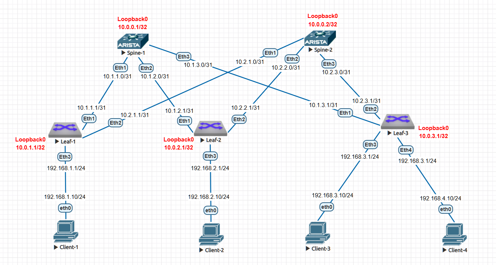

# Лабораторная работа: Настройка iBGP в Underlay сети Clos-топологии

## **Цель работы**
Настроить протокол динамической маршрутизации iBGP в Underlay сети для обеспечения IP-связанности между всеми сетевыми устройствами Clos-топологии.

### **Домашнее задание**
**Цель:** Настроить iBGP для Underlay сети.

**Задачи:**
1) Настроить iBGP в Underlay сети для IP связанности между всеми сетевыми устройствами.
2) Зафиксировать в документации: план работы, адресное пространство, схему сети, конфигурацию устройств.
3) Убедиться в наличии IP связанности между устройствами в iBGP домене.

## **Топология сети**


### **Архитектура:**
- 2 spine коммутатора (spine-1, spine-2)
- 3 leaf коммутатора (leaf-1, leaf-2, leaf-3)

## **Схема IP-адресации**

### **Loopback интерфейсы (Router ID):**
- `spine-1`: 10.0.0.1/32
- `spine-2`: 10.0.0.2/32
- `leaf-1`: 10.0.1.1/32
- `leaf-2`: 10.0.2.1/32
- `leaf-3`: 10.0.3.1/32

### **Spine-Leaf линки (/31):**
```
spine-1 <-> leaf-1: 10.1.1.0/31 (spine .0, leaf .1)
spine-1 <-> leaf-2: 10.1.2.0/31
spine-1 <-> leaf-3: 10.1.3.0/31

spine-2 <-> leaf-1: 10.2.1.0/31
spine-2 <-> leaf-2: 10.2.2.0/31
spine-2 <-> leaf-3: 10.2.3.0/31
```

## **Параметры BGP**
```
AS номер: 65500 (частный AS номер)
Тип: iBGP (внутренний БГП)
Транспортный протокол: IPv4
Номер версии BGP: 4
```

## **План настройки iBGP**

### **1. Концептуальная схема iBGP-пиринга**
В Clos-топологии используется **iBGP с Route Reflector (RR)** архитектурой:
- **Spine коммутаторы** выступают как Route Reflectors
- **Leaf коммутаторы** являются RR-клиентами
- **Full-mesh пиринг между spine** для синхронизации маршрутов

### **2. Базовая настройка iBGP**
1. Настройка Router ID на Loopback интерфейсах
2. Создание iBGP сессий между spine и leaf
3. Настройка Route Reflector на spine коммутаторах
4. Настройка `next-hop-self` для правильной маршрутизации
5. Объявление Loopback сетей в BGP

## **Конфигурация iBGP на устройствах**

### **1. SPINE-1 конфигурация iBGP**
```bash
! spine-1.cfg (дополнение к существующей конфигурации)
router bgp 65500
   router-id 10.0.0.1
   no bgp default ipv4-unicast
   timers bgp 1 3
   distance bgp 20 200 200
   bgp listen range 10.1.0.0/16 peer-group UNDERLAY remote-as 65500
   neighbor UNDERLAY peer group
   neighbor UNDERLAY next-hop-self
   neighbor UNDERLAY bfd
   neighbor UNDERLAY route-reflector-client
   !
   address-family ipv4
      neighbor UNDERLAY activate
      network 10.0.0.1/32
```

### **2. SPINE-2 конфигурация iBGP**
```bash
! spine-2.cfg (аналогичная конфигурация)
router bgp 65500
   router-id 10.0.0.2
   no bgp default ipv4-unicast
   timers bgp 1 3
   distance bgp 20 200 200
   bgp listen range 10.2.0.0/16 peer-group UNDERLAY remote-as 65500
   neighbor UNDERLAY peer group
   neighbor UNDERLAY next-hop-self
   neighbor UNDERLAY bfd
   neighbor UNDERLAY route-reflector-client
   !
   address-family ipv4
      neighbor UNDERLAY activate
      network 10.0.0.2/32
```

### **3. LEAF-1 конфигурация iBGP**
```bash
! leaf-1.cfg (дополнение к существующей конфигурации)
router bgp 65500
   router-id 10.0.1.1
   neighbor 10.1.1.0 remote-as 65500
   neighbor 10.2.1.0 remote-as 65500
   !
   address-family ipv4
      neighbor 10.1.1.0 activate
      neighbor 10.2.1.0 activate
      network 10.0.1.1/32
```

### **4. LEAF-2 и LEAF-3 конфигурация iBGP**
(Аналогичная конфигурация с соответствующими Router ID и neighbor адресами)

## **Особенности настройки iBGP в Clos-топологии**

### **1. Важность next-hop-self**

#### **Экспериментальное доказательство необходимости `next-hop-self`:**
Проведем практический эксперимент для демонстрации критической важности команды `next-hop-self` в iBGP.

**Тест 1: Отключение `next-hop-self` на spine-1**
```bash
spine-1(config)#router bgp 65500
spine-1(config-router-bgp)#no neighbor UNDERLAY next-hop-self
spine-1(config-router-bgp)#clear ip bgp *
```

**Результат на leaf-1 после отключения `next-hop-self`:**
```bash
leaf-1#show ip bgp
         Network                Next Hop            Metric  LocPref Weight  Path
 * >     10.0.2.1/32            10.2.1.0              0       100     0       i Or-ID: 10.0.2.1 C-LST: 10.0.0.2
         10.0.2.1/32            10.1.2.1              0       100     0       i Or-ID: 10.0.2.1 C-LST: 10.0.0.1
```

**Анализ проблемы:**
- Маршрут `10.0.2.1/32` от spine-1 имеет next-hop `10.1.2.1`
- `10.1.2.1` - это IP адрес leaf-2 на интерфейсе к spine-1
- Leaf-1 **не имеет прямого маршрута** до `10.1.2.1` в своей таблице маршрутизации

**Проверка таблицы маршрутизации:**
```bash
leaf-1#show ip route bgp
 B I      10.0.0.1/32 [200/0] via 10.1.1.0, Ethernet1
 B I      10.0.0.2/32 [200/0] via 10.2.1.0, Ethernet2
 B I      10.0.2.1/32 [200/0] via 10.2.1.0, Ethernet2  # Только ОДИН путь!
 B I      10.0.3.1/32 [200/0] via 10.2.1.0, Ethernet2
```

**Вывод:** Без `next-hop-self` маршрут от spine-1 не появляется в таблице маршрутизации leaf-1, так как next-hop недоступен.

---

**Тест 2: Включение `next-hop-self` на spine-1**
```bash
spine-1(config-router-bgp)#neighbor UNDERLAY next-hop-self
spine-1(config-router-bgp)#clear ip bgp *
```

**Результат на leaf-1 после включения `next-hop-self`:**
```bash
leaf-1#show ip bgp
         Network                Next Hop            Metric  LocPref Weight  Path
 * >Ec   10.0.2.1/32            10.2.1.0              0       100     0       i Or-ID: 10.0.2.1 C-LST: 10.0.0.2
 *  ec   10.0.2.1/32            10.1.1.0              0       100     0       i Or-ID: 10.0.2.1 C-LST: 10.0.0.1
```

**Анализ решения:**
- Теперь next-hop от spine-1 изменился на `10.1.1.0` (адрес spine-1 на линке к leaf-1)
- `10.1.1.0` - это **прямо подключенный сосед** leaf-1

**Проверка таблицы маршрутизации:**
```bash
leaf-1#show ip route bgp
 B I      10.0.2.1/32 [200/0] via 10.1.1.0, Ethernet1
                              via 10.2.1.0, Ethernet2  # Теперь ДВА пути доступны
```

#### **Техническое объяснение:**
**Правило iBGP:** По умолчанию iBGP не меняет атрибут next-hop для маршрутов, полученных от iBGP соседей.

**Проблема в Clos-топологии:**
1. Leaf-2 объявляет свой Loopback `10.0.2.1/32` через iBGP
2. Spine-1 получает этот маршрут с next-hop `10.0.2.1` (или `10.1.2.1`)
3. Spine-1 отражает маршрут leaf-1 **без изменения next-hop**
4. Leaf-1 видит next-hop `10.1.2.1`, но не имеет маршрута до него
5. **Итог:** Маршрут неактивен, не устанавливается в таблицу маршрутизации

**Решение через `next-hop-self`:**
1. Spine-1 меняет next-hop на свой адрес (`10.1.1.0`)
2. Leaf-1 имеет прямой маршрут до spine-1
3. **Итог:** Маршрут становится активным и устанавливается в таблицу маршрутизации

### **2. Архитектура Route Reflector**
**Зачем нужна:**
- Избегает full-mesh iBGP (n*(n-1)/2 соединений)
- Spine выступают как концентраторы маршрутной информации
- Упрощает масштабирование сети

## **Диагностика и проверка iBGP**

### **1. Проверка BGP соседств на spine-1**
```bash
spine-1#show ip bgp summary
BGP summary information for VRF default
Router identifier 10.0.0.1, local AS number 65500
Neighbor Status Codes: m - Under maintenance
  Neighbor         V  AS           MsgRcvd   MsgSent  InQ OutQ  Up/Down State   PfxRcd PfxAcc
  10.1.1.1         4  65500           6744      6747    0    0 01:52:20 Estab   1      1
  10.1.2.1         4  65500           2488      2490    0    0 00:41:23 Estab   1      1
  10.1.3.1         4  65500           2012      2014    0    0 00:33:28 Estab   1      1
```

**Анализ:**
- **Router identifier:** 10.0.0.1 (Loopback spine-1)
- **Local AS:** 65500
- **Соседи:** Все три leaf коммутатора
- **Состояние:** Established (установлено)
- **Время работы:** До 1 часа 52 минут
- **Префиксы получено:** По 1 префиксу от каждого leaf (их Loopback адреса)
- **Префиксы принято:** Все 1 префикс принят (PfxAcc = 1)

### **2. Проверка BGP соседств на spine-2**
```bash
spine-2#show ip bgp summary
BGP summary information for VRF default
Router identifier 10.0.0.2, local AS number 65500
  Neighbor         V  AS           MsgRcvd   MsgSent  InQ OutQ  Up/Down State   PfxRcd PfxAcc
  10.2.1.1         4  65500           6625      6627    0    0 01:50:20 Estab   1      1
  10.2.2.1         4  65500           2633      2635    0    0 00:43:48 Estab   1      1
  10.2.3.1         4  65500           2156      2159    0    0 00:35:52 Estab   1      1
```

**Анализ:** Аналогичная картина на spine-2 - все соседства установлены.

### **3. Проверка таблицы маршрутизации BGP на spine-1**
```bash
spine-1#show ip route bgp
 B I      10.0.1.1/32 [200/0] via 10.1.1.1, Ethernet1
 B I      10.0.2.1/32 [200/0] via 10.1.2.1, Ethernet2
 B I      10.0.3.1/32 [200/0] via 10.1.3.1, Ethernet3
```

**Анализ:**
- **B I:** iBGP маршрут
- **[200/0]:** Административное расстояние 200 для iBGP, метрика 0
- **via:** Next-hop адреса (непосредственные адреса leaf коммутаторов)
- Spine-1 узнал все Loopback адреса leaf устройств

### **4. Проверка BGP соседств на leaf-1**
```bash
leaf-1#show ip bgp summary
BGP summary information for VRF default
Router identifier 10.0.1.1, local AS number 65500
  Neighbor         V  AS           MsgRcvd   MsgSent  InQ OutQ  Up/Down State   PfxRcd PfxAcc
  10.1.1.0         4  65500          47393     47389    0    0 01:51:50 Estab   3      3
  10.2.1.0         4  65500          46505     46503    0    0 01:47:24 Estab   3      3
```

**Анализ:**
- Leaf-1 имеет два iBGP соседа: spine-1 (10.1.1.0) и spine-2 (10.2.1.0)
- От каждого соседа получено по 3 префикса
- Все префиксы приняты (PfxAcc = 3)

### **5. Детальный анализ таблицы BGP на leaf-1**
```bash
leaf-1#show ip bgp
BGP routing table information for VRF default
Router identifier 10.0.1.1, local AS number 65500

         Network                Next Hop            Metric  LocPref Weight  Path
 * >     10.0.0.1/32            10.1.1.0              0       100     0       i
 * >     10.0.0.2/32            10.2.1.0              0       100     0       i
 * >     10.0.1.1/32            -                     0       0       -       i
 * >Ec   10.0.2.1/32            10.2.1.0              0       100     0       i Or-ID: 10.0.2.1 C-LST: 10.0.0.2
 *  ec   10.0.2.1/32            10.1.1.0              0       100     0       i Or-ID: 10.0.2.1 C-LST: 10.0.0.1
 * >Ec   10.0.3.1/32            10.2.1.0              0       100     0       i Or-ID: 10.0.3.1 C-LST: 10.0.0.2
 *  ec   10.0.3.1/32            10.1.1.0              0       100     0       i Or-ID: 10.0.3.1 C-LST: 10.0.0.1
```

#### **5.1 Атрибуты Route Reflector:**
```
Or-ID: 10.0.2.1 C-LST: 10.0.0.1
```
- **Or-ID (Originator ID):** 10.0.2.1 - оригинатор маршрута (Leaf-2)
- **C-LST (Cluster List):** 10.0.0.1 - ID Route Reflector (Spine-1)
- Это показывает, что маршрут был отражен через Route Reflector

#### **5.2 Анализ ECMP маршрутов:**
Для маршрута 10.0.2.1/32:
- **Первый маршрут:** `*>Ec` - лучший, участвует в ECMP, через spine-1
- **Второй маршрут:** `* ec` - валидный, ECMP, через spine-2
- **Оба маршрута** имеют одинаковые атрибуты (LocalPref 100, Weight 0)
- **Разные Originator ID и Cluster List** показывают разные пути распространения

### **6. Проверка таблицы маршрутизации BGP на leaf-1**
```bash
leaf-1#show ip route bgp
 B I      10.0.0.1/32 [200/0] via 10.1.1.0, Ethernet1
 B I      10.0.0.2/32 [200/0] via 10.2.1.0, Ethernet2
 B I      10.0.2.1/32 [200/0] via 10.1.1.0, Ethernet1
                              via 10.2.1.0, Ethernet2
 B I      10.0.3.1/32 [200/0] via 10.1.1.0, Ethernet1
                              via 10.2.1.0, Ethernet2
```

**Анализ ECMP:**
- Маршруты до других leaf (10.0.2.1, 10.0.3.1) имеют **два next-hop**
- Это подтверждает работу **ECMP (Equal-Cost Multi-Path)**
- Трафик будет распределяться между spine-1 и spine-2

### **7. Проверка связности между Loopback интерфейсами**
```bash
leaf-1# ping 10.0.2.1 source 10.0.1.1
PING 10.0.2.1 (10.0.2.1) from 10.0.1.1 : 72(100) bytes of data.
80 bytes from 10.0.2.1: icmp_seq=1 ttl=63 time=29.5 ms
80 bytes from 10.0.2.1: icmp_seq=2 ttl=63 time=30.4 ms
80 bytes from 10.0.2.1: icmp_seq=3 ttl=63 time=29.5 ms
80 bytes from 10.0.2.1: icmp_seq=4 ttl=63 time=22.4 ms
80 bytes from 10.0.2.1: icmp_seq=5 ttl=63 time=15.2 ms

--- 10.0.2.1 ping statistics ---
5 packets transmitted, 5 received, 0% packet loss, time 114ms
```

**Результат:** 100% успешных ping, связность установлена.

### **8. Трассировка маршрута и проверка ECMP**
```bash
# Первоначальная трассировка
leaf-1#traceroute 10.0.2.1 source 10.0.1.1
 1  10.1.1.0 (10.1.1.0)  133.961 ms  149.788 ms  158.252 ms
 2  10.0.2.1 (10.0.2.1)  162.139 ms  194.453 ms  202.749 ms
```

**Результат:** Трафик идет через spine-1 (10.1.1.0).

### **9. Тестирование отказоустойчивости ECMP**

**Цель теста:** Проверить способность сети автоматически переключать трафик при отказе одного из путей, используя резервный путь через альтернативный spine.

**Тест 1: Проверка начального состояния**
```bash
leaf-1#show ip route 10.0.2.1
 B I      10.0.2.1/32 [200/0] via 10.1.1.0, Ethernet1
                              via 10.2.1.0, Ethernet2

leaf-1#traceroute 10.0.2.1 source 10.0.1.1
 1  10.1.1.0 (10.1.1.0)  133.961 ms  149.788 ms  158.252 ms
```

**Результат:** ECMP активен, доступны два пути до leaf-2 через оба spine. Трафик идет через spine-1.

**Тест 2: Эмуляция отказа - отключение пути через spine-1**
```bash
leaf-1(config)#interface ethernet1
leaf-1(config-if-Et1)#shutdown

leaf-1#show ip route 10.0.2.1
 B I      10.0.2.1/32 [200/0] via 10.2.1.0, Ethernet2
```

**Результат:** После отключения Ethernet1 остался только один путь через spine-2. Маршрут через spine-1 удален из таблицы маршрутизации.

**Тест 3: Проверка работоспособности через резервный путь**
```bash
leaf-1#traceroute 10.0.2.1 source 10.0.1.1
 1  10.2.1.0 (10.2.1.0)  40.210 ms  44.350 ms  54.011 ms
 2  10.0.2.1 (10.0.2.1)  90.128 ms  97.825 ms  108.584 ms
```

**Результат:** Трафик успешно маршрутизируется через оставшийся путь.

**Тест 4: Восстановление отказавшего пути**
```bash
leaf-1(config-if-Et1)#no shutdown
leaf-1#show ip route 10.0.2.1
 B I      10.0.2.1/32 [200/0] via 10.1.1.0, Ethernet1
                              via 10.2.1.0, Ethernet2
```

**Результат:** После восстановления интерфейса ECMP автоматически восстановился. Снова доступны два пути до leaf-2.

**Выводы тестирования:**
1. **Автоматическое переключение:** При отказе одного пути трафик мгновенно переключается на альтернативный
2. **Нет потери связности:** Ping и traceroute подтверждают непрерывную доступность
3. **Автоматическое восстановление:** После устранения неисправности ECMP самовосстанавливается
4. **Высокая доступность:** Архитектура обеспечивает отказоустойчивость без единой точки отказа