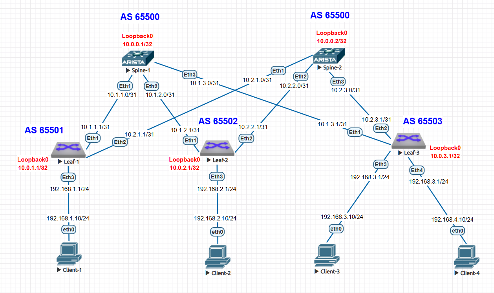

# Лабораторная работа: Настройка eBGP в Underlay сети Clos-топологии

## **Цель работы**
Настроить протокол динамической маршрутизации eBGP в Underlay сети для обеспечения IP-связанности между всеми сетевыми устройствами Clos-топологии.

### **Домашнее задание**
**Цель:** Настроить eBGP для Underlay сети.

**Задачи:**
1) Настроить eBGP в Underlay сети для IP связанности между всеми сетевыми устройствами.
2) Зафиксировать в документации: план работы, адресное пространство, схему сети, конфигурацию устройств.
3) Убедиться в наличии IP связанности между устройствами в eBGP домене.

## **Топология сети**


### **Архитектура:**
- 2 spine коммутатора (spine-1, spine-2) - AS 65500
- 3 leaf коммутатора:
  - leaf-1 - AS 65501
  - leaf-2 - AS 65502  
  - leaf-3 - AS 65503

## **Схема IP-адресации**

### **Loopback интерфейсы (Router ID):**
- `spine-1`: 10.0.0.1/32 (AS 65500)
- `spine-2`: 10.0.0.2/32 (AS 65500)
- `leaf-1`: 10.0.1.1/32 (AS 65501)
- `leaf-2`: 10.0.2.1/32 (AS 65502)
- `leaf-3`: 10.0.3.1/32 (AS 65503)

### **Spine-Leaf линки (/31):**
```
spine-1 <-> leaf-1: 10.1.1.0/31 (spine .0, leaf .1)
spine-1 <-> leaf-2: 10.1.2.0/31
spine-1 <-> leaf-3: 10.1.3.0/31

spine-2 <-> leaf-1: 10.2.1.0/31
spine-2 <-> leaf-2: 10.2.2.0/31
spine-2 <-> leaf-3: 10.2.3.0/31
```

## **Параметры BGP**
```
AS номер: 65500 (spine), 65501-65503 (leaf)
Тип: eBGP (внешний БГП)
Транспортный протокол: IPv4
Номер версии BGP: 4
```

## **План настройки eBGP**

Извините за неточность в формулировке. Это ошибка в тексте. Давайте исправим:

**Неправильно:**
> "Spine не пирингуются между собой (используют разные AS)"

**Правильно должно быть:**
> "Spine не пирингуются между собой, хотя находятся в одной AS"

**Исправленный текст раздела:**

### **1. Концептуальная схема eBGP-пиринга**
В Clos-топологии используется **eBGP между автономными системами**:

- **Spine коммутаторы** находятся в одной AS (65500)
- **Каждый leaf коммутатор** имеет уникальный AS номер (65501-65503)
- **Двунаправленный пиринг** между spine и каждым leaf
- **Spine не пирингуются между собой** через BGP, хотя находятся в одной AS

**Объяснение почему spine не пирингуются между собой:**

1. **Архитектурное решение:** В Clos-топологии spine коммутаторы не обмениваются трафиком напрямую
2. **Все коммуникации leaf-leaf** проходят через прямое соединение leaf-spine
3. **Spine не нуждаются в обмене маршрутами между собой**, так как:
   - Каждый spine независимо получает маршруты от всех leaf
   - Маршруты между leaf всегда проходят через spine (не через spine-spine)
   - Нет необходимости в full-mesh пиринге между spine

**Подтверждение из конфигураций:**
```bash
# spine-1.cfg - нет конфигурации пиринга с spine-2
router bgp 65500
   # нет neighbor 10.0.0.2 или 10.2.x.x
   bgp listen range 10.1.0.0/16 ...  # только leaf подключения

# spine-2.cfg - нет конфигурации пиринга с spine-1  
router bgp 65500
   # нет neighbor 10.0.0.1 или 10.1.x.x
   bgp listen range 10.2.0.0/16 ...  # только leaf подключения
```

**Альтернативные архитектуры:**
1. **Если бы spine пиринговались:** Потребовался бы iBGP между spine с Route Reflector
2. **Текущая архитектура (без пиринга):** Проще, нет сложных зависимостей между spine

**Вывод:** В данной Clos-архитектуре spine работают независимо, каждый получает маршруты непосредственно от leaf коммутаторов через eBGP, что упрощает дизайн и повышает отказоустойчивость.


### **2. Базовая настройка eBGP**
1. Настройка Router ID на Loopback интерфейсах
2. Назначение уникальных AS номеров для каждого leaf
3. Настройка eBGP сессий между spine и leaf
4. Объявление Loopback сетей в BGP
5. Настройка BFD для быстрого обнаружения отказов

## **Конфигурация eBGP на устройствах**

### **1. SPINE-1 конфигурация eBGP**
```bash
! spine-1.cfg
peer-filter LEAVES_ASN
   10 match as-range 65501-65520 result accept

router bgp 65500
   router-id 10.0.0.1
   no bgp default ipv4-unicast
   timers bgp 1 3
   distance bgp 20 200 200
   bgp listen range 10.1.0.0/16 peer-group UNDERLAY peer-filter LEAVES_ASN
   neighbor UNDERLAY peer group
   neighbor UNDERLAY bfd
   !
   address-family ipv4
      neighbor UNDERLAY activate
      network 10.0.0.1/32
```

### **2. SPINE-2 конфигурация eBGP**
```bash
! spine-2.cfg
peer-filter LEAVES_ASN
   10 match as-range 65501-65520 result accept

router bgp 65500
   router-id 10.0.0.2
   no bgp default ipv4-unicast
   timers bgp 1 3
   distance bgp 20 200 200
   bgp listen range 10.2.0.0/16 peer-group UNDERLAY peer-filter LEAVES_ASN
   neighbor UNDERLAY peer group
   neighbor UNDERLAY bfd
   !
   address-family ipv4
      neighbor UNDERLAY activate
      network 10.0.0.2/32
```

### **3. LEAF-1 конфигурация eBGP**
```bash
! leaf-1.cfg
router bgp 65501
   router-id 10.0.1.1
   no bgp default ipv4-unicast
   timers bgp 1 3
   distance bgp 20 200 200
   maximum-paths 2 ecmp 2
   neighbor UNDERLAY peer group
   neighbor UNDERLAY remote-as 65500
   neighbor UNDERLAY out-delay 0
   neighbor UNDERLAY bfd
   neighbor 10.1.1.0 peer group UNDERLAY
   neighbor 10.2.1.0 peer group UNDERLAY
   !
   address-family ipv4
      neighbor UNDERLAY activate
      network 10.0.1.1/32
```

### **4. LEAF-2 конфигурация eBGP**
```bash
! leaf-2.cfg
router bgp 65502
   router-id 10.0.2.1
   no bgp default ipv4-unicast
   timers bgp 1 3
   distance bgp 20 200 200
   maximum-paths 2 ecmp 2
   neighbor UNDERLAY peer group
   neighbor UNDERLAY remote-as 65500
   neighbor UNDERLAY bfd
   neighbor 10.1.2.0 peer group UNDERLAY
   neighbor 10.2.2.0 peer group UNDERLAY
   !
   address-family ipv4
      neighbor UNDERLAY activate
      network 10.0.2.1/32
```

### **5. LEAF-3 конфигурация eBGP**
```bash
! leaf-3.cfg
router bgp 65503
   router-id 10.0.3.1
   no bgp default ipv4-unicast
   timers bgp 1 3
   distance bgp 20 200 200
   maximum-paths 2 ecmp 2
   neighbor UNDERLAY peer group
   neighbor UNDERLAY remote-as 65500
   neighbor UNDERLAY bfd
   neighbor 10.1.3.0 peer group UNDERLAY
   neighbor 10.2.3.0 peer group UNDERLAY
   !
   address-family ipv4
      neighbor UNDERLAY activate
      network 10.0.3.1/32
```

## **Особенности настройки eBGP в Clos-топологии**

### **1. Spine коммутаторы в одной AS**
**Архитектурное решение:** Все spine коммутаторы находятся в одной автономной системе (AS 65500).

**Технические причины:**
1. **Упрощение конфигурации:** Не нужно настраивать eBGP пиринг между spine
2. **Лучший контроль маршрутов:** Spine не обмениваются маршрутами между собой через eBGP
3. **Изоляция fault domain:** Проблемы с BGP на одном spine не влияют на другой через eBGP сессии

**Конфигурационное подтверждение:**
```bash
spine-1#show run | section router bgp
router bgp 65500

spine-2#show run | section router bgp  
router bgp 65500
```

### **2. Использование peer-filter для динамического пиринга**
**Особенность:** Spine коммутаторы используют `bgp listen range` с peer-filter для автоматического установления сессий.

**Преимущества:**
1. **Автоматическое обнаружение соседей:** Не нужно явно указывать каждый leaf адрес
2. **Масштабируемость:** Легко добавить новые leaf коммутаторы
3. **Безопасность:** Фильтрация по диапазону AS номеров (65501-65520)

**Конфигурация:**
```bash
peer-filter LEAVES_ASN
   10 match as-range 65501-65520 result accept

bgp listen range 10.1.0.0/16 peer-group UNDERLAY peer-filter LEAVES_ASN
```

### **3. ECMP (Equal-Cost Multi-Path) на leaf коммутаторах**
**Особенность:** Leaf коммутаторы настроены для использования двух путей через разные spine.

**Конфигурация:**
```bash
maximum-paths 2 ecmp 2
```

**Результат:** Каждый leaf получает одинаковые по стоимости маршруты через оба spine, что обеспечивает:
1. **Балансировку нагрузки:** Трафик распределяется между spine
2. **Отказоустойчивость:** При отказе одного spine трафик идет через другой
3. **Увеличение пропускной способности:** Используется суммарная пропускная способность обоих spine

### **4. BFD (Bidirectional Forwarding Detection)**
**Особенность:** Все BGP сессии защищены BFD для быстрого обнаружения отказов.

**Конфигурация:**
```bash
neighbor UNDERLAY bfd
```

**Преимущества:**
1. **Быстрое обнаружение отказов:** Вместо BGP таймеров (90+ секунд) до 1 секунды
2. **Улучшенная отказоустойчивость:** Быстрое переключение на резервный путь
3. **Снижение потерь трафика:** Минимальное время недоступности

### **5. Настройка out-delay для предотвращения blackhole трафика**

**Особенность:** На leaf-1 присутствует настройка `neighbor UNDERLAY out-delay 0`

**Конфигурация:**
```bash
neighbor UNDERLAY out-delay 0
```

**Проблема, которую решает out-delay:**
В Clos-топологии при перезагрузке или изменении конфигурации BGP на spine коммутаторах может возникнуть ситуация, когда:
1. **BGP сессия восстанавливается** раньше, чем перестраивается таблица маршрутизации
2. **Leaf начинает отправлять трафик** через spine, но spine еще не имеет полной таблицы маршрутизации
3. **Результат:** Трафик "пропадает" (blackhole) пока spine не восстановит маршруты

**Как работает out-delay:**
- **out-delay 0**: Отправка BGP UPDATE сообщений начинается немедленно после установления сессии
- **out-delay N**: Ждет N секунд после установления сессии перед отправкой UPDATE
- **По умолчанию**: 0 секунд (немедленная отправка)

**Почему в данной конфигурации out-delay 0:**
1. **BFD ускоренное обнаружение:** BFD быстро обнаруживает восстановление соседа
2. **Быстрая конвергенция:** Минимизация времени восстановления связности
3. **Стабильная среда:** В лабораторной среде нет проблем с "зависанием" трафика

**Когда может потребоваться out-delay > 0:**
1. **Крупные таблицы маршрутизации:** Когда spine нужно время для обработки тысяч маршрутов
2. **Медленное оборудование:** На устройствах с ограниченными ресурсами CPU/RAM
3. **Сложные политики:** Когда применяются resource-intensive route-maps или фильтры

**Вывод:** В данной лабораторной работе используется `out-delay 0` так как:
1. Маленькая таблица маршрутизации (всего несколько маршрутов)
2. Высокая производительность виртуальных коммутаторов
3. Приоритет на быстрой конвергенции, а не на защите от blackhole

### **6. Агрегированная настройка через Peer Groups**
**Особенность:** Использование peer groups для групповой настройки соседей.

**Конфигурация:**
```bash
neighbor UNDERLAY peer group
neighbor UNDERLAY remote-as 65500
neighbor 10.1.2.0 peer group UNDERLAY
neighbor 10.2.2.0 peer group UNDERLAY
```

**Преимущества:**
1. **Единообразие конфигурации:** Все соседи получают одинаковые параметры
2. **Упрощение изменений:** Изменения применяются ко всей группе
3. **Снижение ошибок:** Меньше ручной конфигурации

### **7. Разные AS номера для каждого leaf**

**Особенность:** Каждый leaf коммутатор имеет уникальный AS номер (65501, 65502, 65503)

**Преимущества:**
1. **Упрощенная диагностика:** Легко идентифицировать источник маршрута по AS Path
2. **Естественная защита от петель:** AS Path содержит уникальные AS, предотвращая loops
3. **Гибкость политик:** Возможность применять разные политики для разных leaf
4. **Улучшенное отслеживание:** В логах и мониторинге четко видно, с каким устройством работаем

**Конфигурационное подтверждение:**
```bash
leaf-1#show run | section router bgp
router bgp 65501

leaf-2#show run | section router bgp  
router bgp 65502

leaf-3#show run | section router bgp
router bgp 65503
```

## **Диагностика и проверка eBGP**

### **1. Проверка BGP соседств на spine-1**
```bash
spine-1#show ip bgp summary
BGP summary information for VRF default
Router identifier 10.0.0.1, local AS number 65500
Neighbor Status Codes: m - Under maintenance
  Neighbor         V  AS           MsgRcvd   MsgSent  InQ OutQ  Up/Down State   PfxRcd PfxAcc
  10.1.1.1         4  65501           1039      1040    0    0 00:17:13 Estab   1      1
  10.1.2.1         4  65502            815       816    0    0 00:13:30 Estab   1      1
  10.1.3.1         4  65503            652       653    0    0 00:10:46 Estab   1      1
```

**Анализ:**
- **Router identifier:** 10.0.0.1 (Loopback spine-1)
- **Local AS:** 65500
- **Соседи:** Все три leaf коммутатора с разными AS (65501-65503)
- **Тип сессий:** eBGP (разные AS номера)
- **Состояние:** Established (установлено)
- **Префиксы получено:** По 1 префиксу от каждого leaf (их Loopback адреса)
- **Префиксы принято:** Все 1 префикс принят (PfxAcc = 1)

### **2. Проверка таблицы маршрутизации BGP на spine-1**
```bash
spine-1#show ip route bgp
 B E      10.0.1.1/32 [20/0] via 10.1.1.1, Ethernet1
 B E      10.0.2.1/32 [20/0] via 10.1.2.1, Ethernet2
 B E      10.0.3.1/32 [20/0] via 10.1.3.1, Ethernet3
```

**Анализ:**
- **B E:** eBGP маршрут
- **[20/0]:** Административное расстояние 20 для eBGP, метрика 0
- **via:** Next-hop адреса (непосредственные адреса leaf коммутаторов)
- Spine-1 узнал все Loopback адреса leaf устройств через eBGP

### **3. Проверка BGP соседств на leaf-2**
```bash
leaf-2#show ip bgp summary
BGP summary information for VRF default
Router identifier 10.0.2.1, local AS number 65502
Neighbor Status Codes: m - Under maintenance
  Neighbor         V  AS           MsgRcvd   MsgSent  InQ OutQ  Up/Down State   PfxRcd PfxAcc
  10.1.2.0         4  65500           1320      1317    0    0 00:21:51 Estab   3      3
  10.2.2.0         4  65500           1318      1319    0    0 00:21:49 Estab   3      3
```

**Анализ:**
- **Router identifier:** 10.0.2.1 (Loopback leaf-2)
- **Local AS:** 65502 (уникальный AS для leaf-2)
- **Соседи:** Оба spine коммутатора в AS 65500
- **Тип сессий:** eBGP (разные AS номера)
- **Префиксы получено:** По 3 префикса от каждого spine
- **Префиксы принято:** Все 3 префикса приняты

### **4. Детальный анализ таблицы BGP на leaf-2**
```bash
leaf-2#sh ip bgp
BGP routing table information for VRF default
Router identifier 10.0.2.1, local AS number 65502

         Network                Next Hop            Metric  LocPref Weight  Path
 * >     10.0.0.1/32            10.1.2.0              0       100     0       65500 i
 * >     10.0.0.2/32            10.2.2.0              0       100     0       65500 i
 * >Ec   10.0.1.1/32            10.1.2.0              0       100     0       65500 65501 i
 *  ec   10.0.1.1/32            10.2.2.0              0       100     0       65500 65501 i
 * >     10.0.2.1/32            -                     0       0       -       i
 * >Ec   10.0.3.1/32            10.1.2.0              0       100     0       65500 65503 i
 *  ec   10.0.3.1/32            10.2.2.0              0       100     0       65500 65503 i
```

#### **4.1 Анализ AS Path:**
```
65500 65501 i
```
- **65500:** AS spine коммутаторов
- **65501:** AS leaf-1
- **i:** Маршрут имеет origin IGP (объявлен командой network)

#### **4.2 Анализ ECMP маршрутов:**
Для маршрута 10.0.1.1/32:
- **Первый маршрут:** `*>Ec` - лучший, участвует в ECMP, через spine-1
- **Второй маршрут:** `* ec` - валидный, ECMP, через spine-2
- **Оба маршрута** имеют одинаковые атрибуты (LocalPref 100, Weight 0, AS Path)
- **Разные next-hop** показывают разные пути через разные spine

### **5. Проверка таблицы маршрутизации BGP на leaf-2**
```bash
leaf-2#sh ip route bgp
 B E      10.0.0.1/32 [20/0] via 10.1.2.0, Ethernet1
 B E      10.0.0.2/32 [20/0] via 10.2.2.0, Ethernet2
 B E      10.0.1.1/32 [20/0] via 10.1.2.0, Ethernet1
                             via 10.2.2.0, Ethernet2
 B E      10.0.3.1/32 [20/0] via 10.1.2.0, Ethernet1
                             via 10.2.2.0, Ethernet2
```

**Анализ ECMP:**
- Маршруты до других leaf (10.0.1.1, 10.0.3.1) имеют **два next-hop**
- Это подтверждает работу **ECMP (Equal-Cost Multi-Path)**
- Трафик будет распределяться между spine-1 и spine-2
- **Административное расстояние:** 20 (eBGP)

### **6. Проверка связности между Loopback интерфейсами**
```bash
leaf-2# ping 10.0.1.1 source 10.0.2.1
PING 10.0.1.1 (10.0.1.1) from 10.0.2.1 : 72(100) bytes of data.
80 bytes from 10.0.1.1: icmp_seq=1 ttl=63 time=32.9 ms
80 bytes from 10.0.1.1: icmp_seq=2 ttl=63 time=37.5 ms
80 bytes from 10.0.1.1: icmp_seq=3 ttl=63 time=130 ms
80 bytes from 10.0.1.1: icmp_seq=4 ttl=63 time=97.4 ms
80 bytes from 10.0.1.1: icmp_seq=5 ttl=63 time=74.3 ms

--- 10.0.1.1 ping statistics ---
5 packets transmitted, 5 received, 0% packet loss, time 103ms
rtt min/avg/max/mdev = 32.973/74.635/130.835/36.849 ms, pipe 3, ipg/ewma 25.809/54.947 ms
```

**Результат:** 100% успешных ping, связность установлена через eBGP.

### **7. Трассировка маршрута и проверка ECMP**
```bash
leaf-2#traceroute 10.0.1.1 source 10.0.2.1
traceroute to 10.0.1.1 (10.0.1.1), 30 hops max, 60 byte packets
 1  10.1.2.0 (10.1.2.0)  44.822 ms  58.039 ms  64.396 ms
 2  10.0.1.1 (10.0.1.1)  66.480 ms  72.941 ms  92.796 ms
```

**Анализ трассировки:**
1. **Первый хоп:** 10.1.2.0 (spine-1) - через Ethernet1
2. **Второй хоп:** 10.0.1.1 (leaf-1) - конечная точка
3. **Маршрут:** leaf-2 → spine-1 → leaf-1

### **8. Тестирование отказоустойчивости ECMP**

**Цель теста:** Проверить способность сети автоматически переключать трафик при отказе одного из путей, используя резервный путь через альтернативный spine.

**Тест 1: Проверка начального состояния**
```bash
leaf-2#show ip route 10.0.1.1
 B E      10.0.1.1/32 [20/0] via 10.1.2.0, Ethernet1
                             via 10.2.2.0, Ethernet2

leaf-2#traceroute 10.0.1.1 source 10.0.2.1
 1  10.1.2.0 (10.1.2.0)  50.797 ms  65.908 ms  78.249 ms
 2  10.0.1.1 (10.0.1.1)  95.307 ms  102.454 ms  111.716 ms
```

**Результат:** ECMP активен, доступны два пути до leaf-1 через оба spine. Трафик идет через spine-1 (Ethernet1).

**Тест 2: Эмуляция отказа - отключение пути через spine-1**
```bash
leaf-2(config)#interface ethernet 1
leaf-2(config-if-Et1)#shutdown

leaf-2#show ip route 10.0.1.1
 B E      10.0.1.1/32 [20/0] via 10.2.2.0, Ethernet2
```

**Результат:** После отключения Ethernet1 остался только один путь через spine-2. Маршрут через spine-1 удален из таблицы маршрутизации.

**Тест 3: Проверка работоспособности через резервный путь**
```bash
leaf-2#traceroute 10.0.1.1 source 10.0.2.1
 1  10.2.2.0 (10.2.2.0)  60.379 ms  63.816 ms  67.029 ms
 2  10.0.1.1 (10.0.1.1)  93.001 ms  99.634 ms  103.784 ms
```

**Результат:** Трафик успешно маршрутизируется через оставшийся путь через spine-2.

**Тест 4: Восстановление отказавшего пути**
```bash
leaf-2(config-if-Et1)#no shutdown
leaf-2#show ip route 10.0.1.1
 B E      10.0.1.1/32 [20/0] via 10.1.2.0, Ethernet1
                             via 10.2.2.0, Ethernet2
```

**Результат:** После восстановления интерфейса ECMP автоматически восстановился. Снова доступны два пути до leaf-1.

**Выводы тестирования eBGP ECMP:**
1. **Автоматическое переключение:** При отказе одного пути eBGP мгновенно переключает трафик на альтернативный
2. **Нет потери связности:** Ping и traceroute подтверждают непрерывную доступность между разными AS
3. **Автоматическое восстановление:** После устранения неисправности ECMP самовосстанавливается
4. **Меж-AS маршрутизация:** eBGP успешно обеспечивает связность между разными автономными системами
5. **Высокая доступность:** Архитектура с eBGP обеспечивает отказоустойчивость без единой точки отказа

## **Сравнение eBGP vs iBGP в Clos-топологии**

### **Преимущества eBGP:**
1. **Более простой дизайн:** Не нужны Route Reflectors
2. **Естественная loop prevention:** AS Path обеспечивает защиту от петель
3. **Лучшая масштабируемость:** Каждый leaf в отдельной AS
4. **Проще диагностика:** Четкое разделение автономных систем

### **Преимущества iBGP:**
1. **Единая политика:** Все устройства в одной AS
2. **Проще фильтрация:** Единая система фильтров
3. **Меньше конфигурации:** Не нужно назначать уникальные AS

### **Выбор для Clos-топологии:**
**eBGP рекомендуется** для крупных дата-центров благодаря:
1. Лучшей масштабируемости
2. Упрощенной диагностике
3. Естественной защите от маршрутных петель
4. Гибкости в управлении политиками для разных leaf

**Итоговая проверка:** Все диагностические команды подтверждают корректную работу eBGP в Clos-топологии с полной связностью между всеми устройствами и отказоустойчивостью через ECMP.