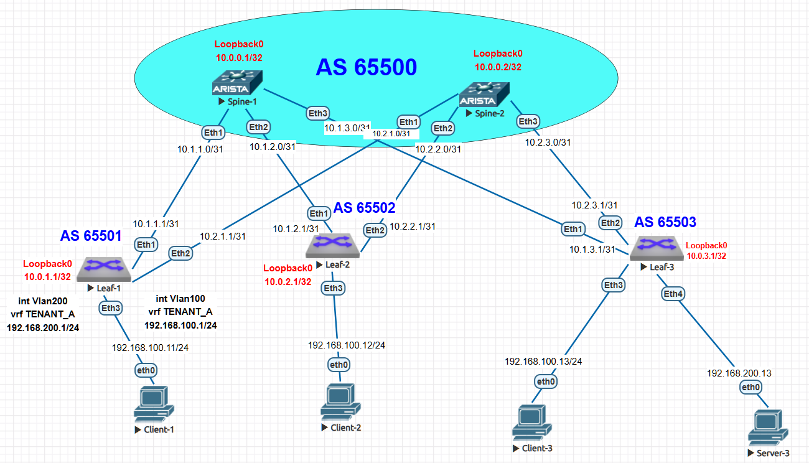

# Лабораторная работа: Настройка VXLAN EVPN для L2 связанности между клиентами

## **Цель работы**
Настроить Overlay сеть на основе VXLAN EVPN для обеспечения L2 связанности между клиентами в Clos-топологии.

### **Домашнее задание**
**Цель:** Настроить VXLAN EVPN для L2 связанности между клиентами.

**Задачи:**
1) Настроить BGP peering между Leaf и Spine в address-family l2vpn evpn
2) Настроить связанность между клиентами в первой зоне (VLAN 100)
3) Зафиксировать в документации: план работы, адресное пространство, схему сети, конфигурацию устройств

## **Топология сети**


### **Архитектура:**
- **2 spine коммутатора** (spine-1, spine-2) - AS 65500
- **3 leaf коммутатора:**
  - leaf-1 - AS 65501
  - leaf-2 - AS 65502  
  - leaf-3 - AS 65503
- **Клиенты:**
  - Client_1, Client_2, Client_3 - VLAN 100 (192.168.100.0/24)
  - Server_3 - VLAN 200 (192.168.200.0/24)

## **Схема IP-адресации**

### **Loopback интерфейсы (Router ID и VTEP):**
```
spine-1: 10.0.0.1/32        (AS 65500) - Router ID
spine-2: 10.0.0.2/32        (AS 65500) - Router ID

leaf-1: 10.0.1.1/32         (AS 65501) - Router ID
        10.0.1.11/32                   - VTEP Source

leaf-2: 10.0.2.1/32         (AS 65502) - Router ID  
        10.0.2.11/32                   - VTEP Source

leaf-3: 10.0.3.1/32         (AS 65503) - Router ID
        10.0.3.11/32                   - VTEP Source
```

### **Underlay сеть (Spine-Leaf линки):**
```
spine-1 <-> leaf-1: 10.1.1.0/31 (spine .0, leaf .1)
spine-1 <-> leaf-2: 10.1.2.0/31
spine-1 <-> leaf-3: 10.1.3.0/31

spine-2 <-> leaf-1: 10.2.1.0/31
spine-2 <-> leaf-2: 10.2.2.0/31
spine-2 <-> leaf-3: 10.2.3.0/31
```

### **Overlay сеть (Клиентские сети):**
```
VLAN 100 (CLIENTS): 192.168.100.0/24
  Gateway: 192.168.100.1/24 (на leaf-1 в VRF TENANT_A)
  Клиенты:
    Client_1: 192.168.100.11/24 (на leaf-1)
    Client_2: 192.168.100.12/24 (на leaf-2)
    Client_3: 192.168.100.13/24 (на leaf-3)

VLAN 200 (SERVERS): 192.168.200.0/24
  Gateway: 192.168.200.1/24 (на leaf-1 в VRF TENANT_A)
  Сервер:
    Server_3: 192.168.200.13/24 (на leaf-3)
```

### **VXLAN параметры:**
```
VLAN 100 → VNI 10100 (L2 VNI)
VLAN 200 → VNI 10200 (L2 VNI)
VRF TENANT_A → VNI 50001 (L3 VNI)

VTEP адреса:
  leaf-1: 10.0.1.11
  leaf-2: 10.0.2.11  
  leaf-3: 10.0.3.11

Flood VTEP списки (head-end replication):
  Все VTEP участвуют в BUM трафике
```

## **Параметры BGP EVPN**

### **Underlay BGP (IPv4):**
- **AS номера:** Spine: 65500, Leaf: 65501-65503
- **Тип:** eBGP
- **Назначение:** Связанность между Loopback адресами для Overlay

### **Overlay BGP (EVPN):**
- **Address Family:** l2vpn evpn
- **Тип:** eBGP мульти-хоп (через Loopback)
- **Назначение:** Обмен EVPN маршрутами для VXLAN

### **EVPN Route-Target сообщества:**
```
VLAN 100: RT 65000:10100 (импорт/экспорт)
VLAN 200: RT 65000:10200 (импорт/экспорт)  
VRF TENANT_A: RT 65000:50001 (импорт/экспорт)
```

## **План настройки VXLAN EVPN**

### **1. Базовая настройка Underlay сети**
1. Настройка IP адресов на физических интерфейсах
2. Настройка Loopback интерфейсов для Router ID и VTEP
3. Настройка eBGP в address-family ipv4 для Underlay связности
4. Проверка IP связанности между всеми Loopback адресами

### **2. Настройка VXLAN**
1. Создание интерфейса Vxlan1
2. Назначение source-interface (VTEP адреса)
3. Сопоставление VLAN к VNI (VLAN 100 → VNI 10100, VLAN 200 → VNI 10200)
4. Настройка L3 VNI для VRF (VNI 50001)
5. Конфигурация flood VTEP для BUM трафика

### **3. Настройка BGP EVPN для Overlay**
1. Создание OVERLAY peer-group для eBGP мульти-хоп сессий
2. Активация address-family evpn
3. Настройка EVPN для каждого VLAN (L2 VNI) с Route Distinguisher и Route-Target
4. Настройка EVPN для VRF (L3 VNI)
5. На spine: настройка route-reflector для EVPN маршрутов

### **4. Настройка L3 интерфейсов (дополнительно)**
1. Создание VRF TENANT_A
2. Настройка SVI интерфейсов с IP адресами шлюзов
3. Активация IP маршрутизации в VRF
4. Redistribute connected в BGP EVPN для VRF

### **5. Подключение клиентов**
1. Настройка access портов в соответствующие VLAN
2. Проверка MAC learning
3. Тестирование L2 связанности между клиентами

## **Конфигурация устройств**

### **1. SPINE-1 конфигурация BGP EVPN**
```bash
! spine-1.cfg
router bgp 65500
   router-id 10.0.0.1
   neighbor 10.0.1.1 remote-as 65501
   neighbor 10.0.1.1 update-source Loopback0
   neighbor 10.0.1.1 allowas-in 1          # Разрешить свой AS в AS-PATH
   neighbor 10.0.1.1 ebgp-multihop 3       # eBGP через Loopback
   neighbor 10.0.1.1 route-reflector-client # RR для EVPN
   neighbor 10.0.1.1 send-community        # Отправлять community
   
   neighbor 10.0.2.1 remote-as 65502
   neighbor 10.0.2.1 update-source Loopback0
   neighbor 10.0.2.1 allowas-in 1
   neighbor 10.0.2.1 ebgp-multihop 3
   neighbor 10.0.2.1 route-reflector-client
   neighbor 10.0.2.1 send-community
   
   neighbor 10.0.3.1 remote-as 65503
   neighbor 10.0.3.1 update-source Loopback0
   neighbor 10.0.3.1 allowas-in 1
   neighbor 10.0.3.1 ebgp-multihop 3
   neighbor 10.0.3.1 route-reflector-client
   neighbor 10.0.3.1 send-community
   
   address-family evpn
      neighbor 10.0.1.1 activate
      neighbor 10.0.2.1 activate
      neighbor 10.0.3.1 activate
```

**Ключевые особенности spine:**
- Все spine находятся в AS 65500
- Настроены как Route-Reflector для EVPN маршрутов
- Используется `allowas-in 1` для обработки AS-PATH в eBGP мульти-хоп
- eBGP сессии установлены через Loopback интерфейсы

### **2. LEAF-1 конфигурация VXLAN EVPN**
```bash
! leaf-1.cfg - основные секции

! Настройка VXLAN
interface Vxlan1
   vxlan source-interface Loopback1      # VTEP адрес 10.0.1.11
   vxlan udp-port 4789                   # Стандартный порт VXLAN
   vxlan vlan 100 vni 10100              # L2 VNI для VLAN 100
   vxlan vlan 200 vni 10200              # L2 VNI для VLAN 200
   vxlan vrf TENANT_A vni 50001          # L3 VNI для VRF
   vxlan flood vtep 10.0.1.11 10.0.2.11 10.0.3.11  # Head-end replication

! Настройка VLAN интерфейсов (SVI) с VRF
interface Vlan100
   description Gateway for VLAN 100
   vrf TENANT_A                          # Интерфейс в VRF
   ip address 192.168.100.1/24           # Шлюз для клиентов

interface Vlan200
   description Gateway for VLAN 200
   vrf TENANT_A
   ip address 192.168.200.1/24

! Настройка BGP EVPN
router bgp 65501
   router-id 10.0.1.1
   
   ! Overlay peer-group для eBGP мульти-хоп
   neighbor OVERLAY peer group
   neighbor OVERLAY remote-as 65500
   neighbor OVERLAY update-source Loopback0
   neighbor OVERLAY ebgp-multihop 3
   neighbor OVERLAY send-community
   
   neighbor 10.0.0.1 peer group OVERLAY  # spine-1
   neighbor 10.0.0.2 peer group OVERLAY  # spine-2
   
   ! L2 EVPN сегменты (MAC-VRF)
   vlan 100
      rd 10.0.1.11:10100                 # Route Distinguisher
      route-target import 65000:10100    # Импорт RT
      route-target export 65000:10100    # Экспорт RT
      redistribute learned               # Передача локальных MAC
   
   vlan 200
      rd 10.0.1.11:10200
      route-target import 65000:10200
      route-target export 65000:10200
      redistribute learned
   
   ! L3 EVPN сегмент (IP-VRF)
   vrf TENANT_A
      rd 10.0.1.11:1
      route-target import evpn 65000:50001
      route-target export evpn 65000:50001
      redistribute connected             # Передача IP маршрутов
   
   ! Активация EVPN
   address-family evpn
      neighbor OVERLAY activate
```

### **3. LEAF-2 и LEAF-3 конфигурация**
Конфигурации leaf-2 и leaf-3 аналогичны leaf-1, но:
- Используют свои AS номера (65502, 65503)
- Используют свои VTEP адреса (10.0.2.11, 10.0.3.11)
- **Не имеют SVI интерфейсов** - только L2 функциональность
- RD формируются на основе своих VTEP адресов

## **Архитектурные особенности реализации**

### **1. Комбинированная архитектура L2 и L3 VXLAN**
**Важное замечание:** В данной лабораторной работе реализована **комбинированная архитектура**, которая включает как **L2 VXLAN**, так и **L3 VXLAN**:

#### **L2 VXLAN (основная задача):**
- VLAN 100 ↔ VNI 10100
- VLAN 200 ↔ VNI 10200
- Обеспечивает **сквозную L2 связанность** между клиентами в одном VLAN через разные leaf
- MAC-адреса передаются через EVPN Type 2 маршруты

#### **L3 VXLAN (дополнительная функциональность):**
- VRF TENANT_A ↔ VNI 50001
- Обеспечивает **меж-VLAN маршрутизацию** через VXLAN
- Только leaf-1 имеет SVI интерфейсы и выступает как L3 шлюз
- IP маршруты передаются через EVPN Type 5 маршруты

#### **Преимущества комбинированного подхода:**
1. **Гибкость:** Одни leaf могут быть L2-only, другие - L2/L3
2. **Масштабируемость:** L3 функциональность может быть добавлена выборочно
3. **Отказоустойчивость:** В будущем можно добавить anycast gateway на всех leaf

### **2. Асимметричный дизайн L3 шлюзов**
- **Leaf-1:** Имеет полную L3 функциональность (SVI для VLAN 100/200)
- **Leaf-2 и Leaf-3:** Только L2 функциональность
- **Следствие:** Весь меж-VLAN трафик идет через leaf-1
- **В production:** Рекомендуется использовать anycast gateway на всех leaf

### **3. Head-End Replication для BUM трафика**
```
vxlan flood vtep 10.0.1.11 10.0.2.11 10.0.3.11
```
- Каждый VTEP реплицирует BUM трафик всем остальным VTEP
- Альтернатива: Underlay Multicast (не используется в данной lab)

### **4. eBGP как IGP для Underlay**
- Используется eBGP вместо OSPF/IS-IS
- Проще в настройке и диагностике
- Естественная поддержка ECMP

### **5. Route Reflector на Spine**
- Spine коммутаторы настроены как Route Reflector
- Упрощает BGP топологию (не нужен full-mesh между leaf)
- Стандартная практика в Clos-архитектуре

Понял! Исправляю только указанные пункты диагностики, используя ВАШИ реальные данные из файла diag:

## **Диагностика и проверка VXLAN EVPN**

### **1. Проверка BGP EVPN сессий**

#### **На leaf-1:**
```bash
leaf-1#show bgp evpn summary
BGP summary information for VRF default
Router identifier 10.0.1.1, local AS number 65501
Neighbor Status Codes: m - Under maintenance
  Neighbor V AS           MsgRcvd   MsgSent  InQ OutQ  Up/Down State   PfxRcd PfxAcc
  10.0.0.1 4 65500           9100      9103    0    0 01:07:56 Estab   4      4
  10.0.0.2 4 65500           9135      9138    0    0 01:07:56 Estab   4      4
```

**Анализ:**
- **Router identifier:** 10.0.1.1
- **Local AS:** 65501
- **Соседи:** spine-1 (10.0.0.1) и spine-2 (10.0.0.2) в AS 65500
- **Состояние:** Established (~1 час работы)
- **Получено префиксов:** По 4 EVPN маршрута от каждого spine

#### **На leaf-2:**
```bash
leaf-2#show bgp evpn summary
BGP summary information for VRF default
Router identifier 10.0.2.1, local AS number 65502
Neighbor Status Codes: m - Under maintenance
  Neighbor V AS           MsgRcvd   MsgSent  InQ OutQ  Up/Down State   PfxRcd PfxAcc
  10.0.0.1 4 65500           8084      8131    0    0 01:42:22 Estab   6      6
  10.0.0.2 4 65500           8112      8152    0    0 01:42:22 Estab   6      6
```

#### **На leaf-3:**
```bash
leaf-3#show bgp evpn summary
BGP summary information for VRF default
Router identifier 10.0.3.1, local AS number 65503
Neighbor Status Codes: m - Under maintenance
  Neighbor V AS           MsgRcvd   MsgSent  InQ OutQ  Up/Down State   PfxRcd PfxAcc
  10.0.0.1 4 65500          92876     93102    0    0 01:07:03 Estab   6      6
  10.0.0.2 4 65500          96420     96610    0    0 01:07:02 Estab   6      6
```

**Вывод:** Все EVPN сессии установлены, leaf получают от 4 до 6 EVPN маршрутов через оба spine.

### **2. Проверка VXLAN VTEP**

#### **На leaf-1:**
```bash
leaf-1#show vxlan vtep
Remote VTEPS for Vxlan1:

VTEP            Tunnel Type(s)
--------------- --------------
10.0.1.11       flood
10.0.2.11       flood
10.0.3.11       flood

Total number of remote VTEPS:  3
```

#### **На leaf-2:**
```bash
leaf-2#show vxlan vtep
Remote VTEPS for Vxlan1:

VTEP            Tunnel Type(s)
--------------- --------------
10.0.1.1        flood
10.0.1.11       unicast, flood
10.0.2.11       flood
10.0.3.1        flood
10.0.3.11       flood

Total number of remote VTEPS:  5
```

#### **На leaf-3:**
```bash
leaf-3#show vxlan vtep
Remote VTEPS for Vxlan1:

VTEP            Tunnel Type(s)
--------------- --------------
10.0.1.11       flood, unicast
10.0.2.11       flood
10.0.3.11       flood

Total number of remote VTEPS:  3
```

**Вывод:** Все VTEP (10.0.1.11, 10.0.2.11, 10.0.3.11) видят друг друга через flood-туннели для BUM трафика.

### **3. Проверка таблицы MAC-адресов**

#### **На leaf-1:**
```bash
leaf-1#show mac address-table
          Mac Address Table
------------------------------------------------------------------

Vlan    Mac Address       Type        Ports      Moves   Last Move
----    -----------       ----        -----      -----   ---------
 100    0050.7966.6806    DYNAMIC     Et3        1       0:05:18 ago
 100    0050.7966.6807    DYNAMIC     Vx1        1       0:05:09 ago
 100    0050.7966.6808    DYNAMIC     Vx1        1       0:04:52 ago
 200    0050.7966.6809    DYNAMIC     Vx1        1       0:05:18 ago
Total Mac Addresses for this criterion: 4

leaf-1#show mac address-table vlan 100
          Mac Address Table
------------------------------------------------------------------

Vlan    Mac Address       Type        Ports      Moves   Last Move
----    -----------       ----        -----      -----   ---------
 100    0050.7966.6807    DYNAMIC     Vx1        1       0:05:33 ago
 100    0050.7966.6808    DYNAMIC     Vx1        1       0:05:15 ago
Total Mac Addresses for this criterion: 2

leaf-1#show mac address-table | include Vx
 100    0050.7966.6807    DYNAMIC     Vx1        1       0:05:48 ago
 200    0050.7966.6809    DYNAMIC     Vx1        1       0:05:57 ago
```

**Вывод:** Leaf-1 знает:
- **Локальный MAC** 0050.7966.6806 (Client_1) через порт Et3
- **Удаленные MAC** через Vx1 (VXLAN туннель):
  - 0050.7966.6807 (Client_2)
  - 0050.7966.6808 (Client_3)
  - 0050.7966.6809 (Server_3)

### **4. Проверка VXLAN интерфейса и flood списков**

#### **На leaf-1:**
```bash
leaf-1#show interface vxlan1
Vxlan1 is up, line protocol is up (connected)
  Hardware is Vxlan
  Source interface is Loopback1 and is active with 10.0.1.11
  Listening on UDP port 4789
  Replication/Flood Mode is headend with Flood List Source: EVPN, CLI
  Remote MAC learning via EVPN
  VNI mapping to VLANs
  Static VLAN to VNI mapping is
    [100, 10100]      [200, 10200]
  Dynamic VLAN to VNI mapping for 'evpn' is
    [4094, 50001]
  Static VRF to VNI mapping is
   [TENANT_A, 50001]
  Headend replication flood vtep list is:
   100 10.0.2.11       10.0.1.11       10.0.3.11
   200 10.0.2.11       10.0.1.11       10.0.3.11
  4094 10.0.2.11       10.0.1.11       10.0.3.11

leaf-1#show vxlan flood vtep
          VXLAN Flood VTEP Table
--------------------------------------------------------------------------------

VLANS                            Ip Address
-----------------------------   ------------------------------------------------
100,200,4094 *                  10.0.1.11       10.0.2.11       10.0.3.11
* All VLANs in the indicated VLAN range list are using the default VTEP flood list
```

#### **На leaf-2:**
```bash
leaf-2#show vxlan flood vtep
          VXLAN Flood VTEP Table
--------------------------------------------------------------------------------

VLANS                            Ip Address
-----------------------------   ------------------------------------------------
100,200,4078 *                  10.0.1.11       10.0.2.11       10.0.3.11
```

#### **На leaf-3:**
```bash
leaf-3#show vxlan flood vtep
          VXLAN Flood VTEP Table
--------------------------------------------------------------------------------

VLANS                            Ip Address
-----------------------------   ------------------------------------------------
100,200,4074 *                  10.0.1.11       10.0.2.11       10.0.3.11
```

**Вывод:** Все три VTEP (10.0.1.11, 10.0.2.11, 10.0.3.11) включены в flood списки для VLAN 100, 200 и внутренних VLAN (4094, 4078, 4074).

### **5. Проверка EVPN маршрутов типа 2 (MAC/IP)**

#### **На leaf-1:**
```bash
leaf-1#show bgp evpn route-type mac-ip
BGP routing table information for VRF default
Router identifier 10.0.1.1, local AS number 65501

          Network                Next Hop              Metric  LocPref Weight  Path
 * >      RD: 10.0.1.11:10100 mac-ip 0050.7966.6806
                                 -                     -       -       0       i
 * >      RD: 10.0.1.11:10100 mac-ip 0050.7966.6806 192.168.100.11
                                 -                     -       -       0       i
 * >Ec    RD: 10.0.2.11:10100 mac-ip 0050.7966.6807
                                 10.0.2.11             -       100     0       65500 65502 i
 *  ec    RD: 10.0.2.11:10100 mac-ip 0050.7966.6807
                                 10.0.2.11             -       100     0       65500 65502 i
 * >Ec    RD: 10.0.3.11:10100 mac-ip 0050.7966.6808
                                 10.0.3.11             -       100     0       65500 65503 i
 *  ec    RD: 10.0.3.11:10100 mac-ip 0050.7966.6808
                                 10.0.3.11             -       100     0       65500 65503 i
 * >Ec    RD: 10.0.3.11:10200 mac-ip 0050.7966.6809
                                 10.0.3.11             -       100     0       65500 65503 i
 *  ec    RD: 10.0.3.11:10200 mac-ip 0050.7966.6809
                                 10.0.3.11             -       100     0       65500 65503 i

leaf-1#show bgp evpn route-type mac-ip vni 10100
          Network                Next Hop              Metric  LocPref Weight  Path
 * >      RD: 10.0.1.11:10100 mac-ip 0050.7966.6806
                                 -                     -       -       0       i
 * >      RD: 10.0.1.11:10100 mac-ip 0050.7966.6806 192.168.100.11
                                 -                     -       -       0       i
 * >Ec    RD: 10.0.2.11:10100 mac-ip 0050.7966.6807
                                 10.0.2.11             -       100     0       65500 65502 i
 *  ec    RD: 10.0.2.11:10100 mac-ip 0050.7966.6807
                                 10.0.2.11             -       100     0       65500 65502 i
 * >Ec    RD: 10.0.3.11:10100 mac-ip 0050.7966.6808
                                 10.0.3.11             -       100     0       65500 65503 i
 *  ec    RD: 10.0.3.11:10100 mac-ip 0050.7966.6808
                                 10.0.3.11             -       100     0       65500 65503 i

leaf-1#show bgp evpn route-type mac-ip vni 10200
          Network                Next Hop              Metric  LocPref Weight  Path
 * >Ec    RD: 10.0.3.11:10200 mac-ip 0050.7966.6809
                                 10.0.3.11             -       100     0       65500 65503 i
 *  ec    RD: 10.0.3.11:10200 mac-ip 0050.7966.6809
                                 10.0.3.11             -       100     0       65500 65503 i
```

**Вывод:** Leaf-1 получил через EVPN:
1. **Локальные маршруты:** Собственный MAC 0050.7966.6806 (Client_1)
2. **Удаленные маршруты:**
   - MAC 0050.7966.6807 (Client_2) от leaf-2 через AS Path 65500 65502
   - MAC 0050.7966.6808 (Client_3) от leaf-3 через AS Path 65500 65503
   - MAC 0050.7966.6809 (Server_3) от leaf-3 через AS Path 65500 65503
3. **ECMP:** Каждый маршрут имеет ECMP дубликаты через оба spine

### **6. Проверка EVPN маршрутов типа 3 (Inclusive Multicast)**

#### **На leaf-1:**
```bash
leaf-1#show bgp evpn route-type imet
          Network                Next Hop              Metric  LocPref Weight  Path
 * >      RD: 10.0.1.11:10100 imet 10.0.1.11
                                 -                     -       -       0       i
 * >      RD: 10.0.1.11:10200 imet 10.0.1.11
                                 -                     -       -       0       i
 * >Ec    RD: 10.0.2.11:10100 imet 10.0.2.11
                                 10.0.2.11             -       100     0       65500 65502 i
 *  ec    RD: 10.0.2.11:10100 imet 10.0.2.11
                                 10.0.2.11             -       100     0       65500 65502 i
 * >Ec    RD: 10.0.2.11:10200 imet 10.0.2.11
                                 10.0.2.11             -       100     0       65500 65502 i
 *  ec    RD: 10.0.2.11:10200 imet 10.0.2.11
                                 10.0.2.11             -       100     0       65500 65502 i
 * >Ec    RD: 10.0.3.11:10100 imet 10.0.3.11
                                 10.0.3.11             -       100     0       65500 65503 i
 *  ec    RD: 10.0.3.11:10100 imet 10.0.3.11
                                 10.0.3.11             -       100     0       65500 65503 i
 * >Ec    RD: 10.0.3.11:10200 imet 10.0.3.11
                                 10.0.3.11             -       100     0       65500 65503 i
 *  ec    RD: 10.0.3.11:10200 imet 10.0.3.11
                                 10.0.3.11             -       100     0       65500 65503 i
```

**Вывод:** Type 3 маршруты (Inclusive Multicast) используются для:
- Обнаружения удаленных VTEP
- Построения flood списков для BUM трафика
- Каждый VTEP анонсирует себя для каждого VNI (10100, 10200)
- ECMP дубликаты через оба spine обеспечивают отказоустойчивость

## **Итоги диагностики**

1. **EVPN сессии:** Все BGP EVPN сессии установлены и стабильны
2. **VTEP обнаружение:** Все три VTEP видят друг друга
3. **MAC learning:** Leaf-1 знает MAC-адреса всех клиентов (локальные и удаленные через VXLAN)
4. **EVPN маршруты:** Получены Type 2 (MAC/IP) и Type 3 (Inclusive Multicast) маршруты
5. **Flood списки:** Все VTEP включены в flood списки для BUM трафика
6. **ECMP:** Маршруты получены через оба spine с ECMP дубликатами

**Вывод:** VXLAN EVPN настроен корректно, L2 связанность между клиентами обеспечена через VXLAN туннели.