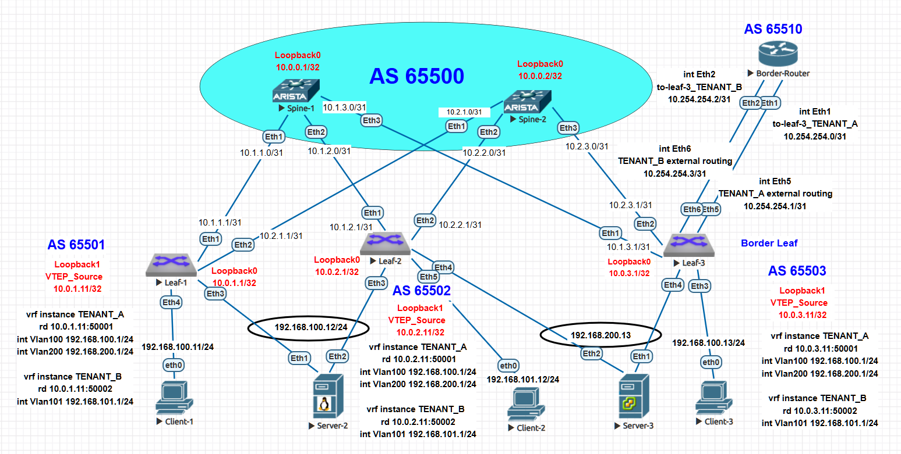

# Лабораторная работа: EVPN Type-5 маршрутизация между VRF

## **Тема работы**
VxLAN. Routing.

## **Цель:**
Реализовать передачу суммарных префиксов через EVPN route-type 5 и настроить маршрутизацию между разными VRF через внешнее устройство (Border-Router).

## **Описание/Пошаговая инструкция выполнения домашнего задания:**
В этой самостоятельной работе мы ожидаем, что вы самостоятельно:

1. Разместите двух "клиентов" в разных VRF в рамках одной фабрики.
2. Настроите маршрутизацию между клиентами через внешнее устройство (граничный роутер\фаерволл\etc).
3. Зафиксируете в документацию - план работы, адресное пространство, схему сети, настройки сетевого оборудования.

---

## **Топология сети**


#### **Роли устройств:**
- **Leaf-1, Leaf-2, Leaf-3** - коммутаторы доступа в EVPN/VXLAN fabric
- **Leaf-3** - дополнительная роль граничного маршрутизатора (Border Leaf)
- **Spine-1, Spine-2** - коммутаторы агрегации уровня
- **Border-Router** - внешнее устройство для маршрутизации между VRF
- **Client-1, Client-3** - клиенты в VRF TENANT_A
- **Client-2** - клиент в VRF TENANT_B
- **Server-2, Server-3** - серверы в VRF TENANT_A

## **Адресное пространство**

### **Underlay сеть (IBGP):**
```
Spine-1: 10.0.0.1/32        (AS 65500)
Spine-2: 10.0.0.2/32        (AS 65500)

Leaf-1:  10.0.1.1/32        (AS 65501)
Leaf-1:  10.0.1.11/32       (VTEP Source)
Leaf-2:  10.0.2.1/32        (AS 65502)  
Leaf-2:  10.0.2.11/32       (VTEP Source)
Leaf-3:  10.0.3.1/32        (AS 65503)
Leaf-3:  10.0.3.11/32       (VTEP Source)
```

### **Overlay сеть (Клиентские VRF):**
```
VRF TENANT_A:
  - 192.168.100.0/24 (VLAN 100, VNI 10100, L3VNI 50001)
    * Client-1: 192.168.100.11/24 (на leaf-1)
    * Client-3: 192.168.100.13/24 (на leaf-3)
    * Server-2: 192.168.100.12/24 (multihoming leaf-1/leaf-2)
  - 192.168.200.0/24 (VLAN 200, VNI 10200, L3VNI 50001)
    * Server-3: 192.168.200.13/24 (multihoming leaf-2/leaf-3)

VRF TENANT_B:
  - 192.168.101.0/24 (VLAN 101, VNI 10101, L3VNI 50002)
    * Client-2: 192.168.101.12/24 (на leaf-2)
```

### **External Routing Network:**
```
Border-Router ↔ Leaf-3 (TENANT_A): 10.254.254.0/31
  - Border-Router: 10.254.254.0/31
  - Leaf-3 Eth5: 10.254.254.1/31 (VRF TENANT_A)

Border-Router ↔ Leaf-3 (TENANT_B): 10.254.254.2/31
  - Border-Router: 10.254.254.2/31  
  - Leaf-3 Eth6: 10.254.254.3/31 (VRF TENANT_B)
```

## **Конфигурации ключевых устройств**

### **1. Leaf-3 (Border Leaf) - Основная конфигурация**

```eos
! Настройка VRF
vrf instance TENANT_A
   rd 10.0.3.11:50001

vrf instance TENANT_B
   rd 10.0.3.11:50002

! Интерфейсы к Border-Router
interface Ethernet5
   description TENANT_A external routing
   mtu 9214
   no switchport
   vrf TENANT_A
   ip address 10.254.254.1/31

interface Ethernet6
   description TENANT_B external routing
   mtu 9214
   no switchport
   vrf TENANT_B
   ip address 10.254.254.3/31

! Статические маршруты для меж-VRF маршрутизации через Border-Router
ip route vrf TENANT_A 192.168.101.0/24 10.254.254.0
ip route vrf TENANT_B 192.168.100.0/24 10.254.254.2
ip route vrf TENANT_B 192.168.200.0/24 10.254.254.2

! BGP EVPN Type-5 конфигурация
router bgp 65503
   vrf TENANT_A
      rd 10.0.3.11:50001
      route-target import evpn 65000:50001
      route-target export evpn 65000:50001
      !
      address-family ipv4
         redistribute connected
         redistribute static
   
   vrf TENANT_B
      rd 10.0.3.11:50002
      route-target import evpn 65000:50002
      route-target export evpn 65000:50002
      !
      address-family ipv4
         redistribute connected
         redistribute static
```

**Ключевые моменты:**
- `redistribute static` - редистрибьюция статических маршрутов в BGP EVPN
- Статические маршруты указывают на Border-Router как next-hop
- **НЕТ VRF leaking** между TENANT_A и TENANT_B

### **2. Leaf-1 (клиенты в TENANT_A)**

```eos
vrf instance TENANT_A
   rd 10.0.1.11:50001

vrf instance TENANT_B
   rd 10.0.1.11:50002

! BGP EVPN конфигурация БЕЗ VRF leaking
router bgp 65501
   vrf TENANT_A
      rd 10.0.1.11:50001
      route-target import evpn 65000:50001  ! Только свои маршруты
      route-target export evpn 65000:50001
      redistribute connected
   
   vrf TENANT_B
      rd 10.0.1.11:50002
      route-target import evpn 65000:50002  ! Только свои маршруты
      route-target export evpn 65000:50002
      !
      address-family ipv4
         redistribute connected
```

### **3. Leaf-2 (клиенты в TENANT_B)**

```eos
vrf instance TENANT_A
   rd 10.0.2.11:50001

vrf instance TENANT_B
   rd 10.0.2.11:50002

router bgp 65502
   vrf TENANT_A
      rd 10.0.2.11:50001
      route-target import evpn 65000:50001  ! Только свои маршруты
      route-target export evpn 65000:50001
      redistribute connected
   
   vrf TENANT_B
      rd 10.0.2.11:50002
      route-target import evpn 65000:50002  ! Только свои маршруты
      route-target export evpn 65000:50002
      !
      address-family ipv4
         redistribute connected
```

### **4. Border-Router**

```eos
! Интерфейсы к Leaf-3
interface Ethernet1
   description to-leaf-3_TENANT_A
   no switchport
   ip address 10.254.254.0/31

interface Ethernet2
   description to-leaf-3_TENANT_B
   no switchport
   ip address 10.254.254.2/31

! Статические маршруты для меж-VRF маршрутизации
ip route 192.168.100.0/24 10.254.254.1    ! TENANT_A сети → Leaf-3
ip route 192.168.101.0/24 10.254.254.3    ! TENANT_B сети → Leaf-3
ip route 192.168.200.0/24 10.254.254.1    ! TENANT_A сети → Leaf-3

! BGP для обмена маршрутами с leaf-3
router bgp 65510
   router-id 10.254.254.254
   neighbor 10.254.254.1 remote-as 65503
   neighbor 10.254.254.3 remote-as 65503
   !
   address-family ipv4
      neighbor 10.254.254.1 activate
      neighbor 10.254.254.3 activate
      network 10.254.254.254/32
      redistribute static
```

## **Команды диагностики и проверки**

### **1. Проверка EVPN Type-5 маршрутов**

#### **На Leaf-3 (источник статических маршрутов):**
```bash
leaf-3#show bgp evpn route-type ip-prefix ipv4 | i 10.0.3.11:
 * >      RD: 10.0.3.11:50001 ip-prefix 10.254.254.0/31
 * >      RD: 10.0.3.11:50002 ip-prefix 10.254.254.2/31
 * >      RD: 10.0.3.11:50001 ip-prefix 192.168.100.0/24
 * >      RD: 10.0.3.11:50002 ip-prefix 192.168.100.0/24
 * >      RD: 10.0.3.11:50001 ip-prefix 192.168.101.0/24
 * >      RD: 10.0.3.11:50002 ip-prefix 192.168.101.0/24
 * >      RD: 10.0.3.11:50001 ip-prefix 192.168.200.0/24
 * >      RD: 10.0.3.11:50002 ip-prefix 192.168.200.0/24
```

**Анализ вывода на Leaf-3:**
- ✅ **Статические маршруты успешно редистрибьютируются** в EVPN как Type-5 маршруты благодаря команде `redistribute static` в BGP
- ✅ **Маршруты из "чужого" VRF помечаются соответствующим RD:**
  - `RD: 10.0.3.11:50001 ip-prefix 192.168.101.0/24` - статический маршрут из TENANT_A, указывающий на сеть TENANT_B
  - `RD: 10.0.3.11:50002 ip-prefix 192.168.100.0/24` - статический маршрут из TENANT_B, указывающий на сеть TENANT_A
  - `RD: 10.0.3.11:50002 ip-prefix 192.168.200.0/24` - статический маршрут из TENANT_B, указывающий на сеть TENANT_A
- ✅ **Прямые подключения к Border-Router** также анонсируются как Type-5:
  - `RD: 10.0.3.11:50001 ip-prefix 10.254.254.0/31` - интерфейс в VRF TENANT_A
  - `RD: 10.0.3.11:50002 ip-prefix 10.254.254.2/31` - интерфейс в VRF TENANT_B
- ✅ **Символ ">"** указывает на активные (best) маршруты

#### **На Leaf-1 (получатель маршрутов):**
```bash
leaf-1#show bgp evpn route-type ip-prefix ipv4 | include 192.168.101
 * >      RD: 10.0.1.11:50002 ip-prefix 192.168.101.0/24
 * >Ec    RD: 10.0.2.11:50002 ip-prefix 192.168.101.0/24
 *  ec    RD: 10.0.2.11:50002 ip-prefix 192.168.101.0/24
 * >Ec    RD: 10.0.3.11:50001 ip-prefix 192.168.101.0/24
 *  ec    RD: 10.0.3.11:50001 ip-prefix 192.168.101.0/24
 * >Ec    RD: 10.0.3.11:50002 ip-prefix 192.168.101.0/24
 *  ec    RD: 10.0.3.11:50002 ip-prefix 192.168.101.0/24
```

**Анализ вывода на Leaf-1:**
- ✅ **Leaf-1 успешно получает статический маршрут** `RD: 10.0.3.11:50001 ip-prefix 192.168.101.0/24` от leaf-3
- ✅ **Маршрут помечен как "Ec"** - получен через eBGP от внешнего AS
- ✅ **RD 10.0.3.11:50001** указывает, что маршрут пришел из VRF TENANT_A на устройстве leaf-3
- ✅ **Маршрут импортируется в VRF TENANT_A** на leaf-1 через `route-target import evpn 65000:50001`
- ✅ **Наличие нескольких экземпляров маршрута** (с RD 10.0.1.11:50002, 10.0.2.11:50002, 10.0.3.11:50002) показывает, что сеть 192.168.101.0/24 также анонсируется как локальная в TENANT_B другими leaf

#### **На Leaf-2 (получатель маршрутов):**
```bash
leaf-2#show bgp evpn route-type ip-prefix ipv4 | include 192.168.100
 * >Ec    RD: 10.0.1.11:50001 ip-prefix 192.168.100.0/24
 *  ec    RD: 10.0.1.11:50001 ip-prefix 192.168.100.0/24
 * >      RD: 10.0.2.11:50001 ip-prefix 192.168.100.0/24
 * >Ec    RD: 10.0.3.11:50001 ip-prefix 192.168.100.0/24
 *  ec    RD: 10.0.3.11:50001 ip-prefix 192.168.100.0/24
 * >Ec    RD: 10.0.3.11:50002 ip-prefix 192.168.100.0/24
 *  ec    RD: 10.0.3.11:50002 ip-prefix 192.168.100.0/24
```

**Анализ вывода на Leaf-2:**
- ✅ **Leaf-2 успешно получает статический маршрут** `RD: 10.0.3.11:50002 ip-prefix 192.168.100.0/24` от leaf-3
- ✅ **Маршрут помечен как "Ec"** - получен через eBGP от внешнего AS
- ✅ **RD 10.0.3.11:50002** указывает, что маршрут пришел из VRF TENANT_B на устройстве leaf-3
- ✅ **Маршрут импортируется в VRF TENANT_B** на leaf-2 через `route-target import evpn 65000:50002`
- ✅ **Наличие маршрута с RD 10.0.3.11:50001** показывает, что сеть 192.168.100.0/24 также анонсируется как локальная в TENANT_A leaf-3

**Общий анализ EVPN Type-5 маршрутизации:**
- ✅ **Цель лабораторной работы достигнута** - суммарные префиксы успешно передаются через EVPN route-type 5
- ✅ **Статические маршруты меж-VRF маршрутизации** (192.168.101.0/24, 192.168.100.0/24, 192.168.200.0/24) распространяются через EVPN fabric
- ✅ **Маршруты правильно помечены RD** в соответствии с исходным VRF
- ✅ **Все leaf коммутаторы получают маршруты** через BGP EVPN
- ✅ **Архитектура без VRF leaking работает** - маршруты импортируются только в соответствующие VRF

### **2. Проверка таблиц маршрутизации VRF**

#### **На Leaf-3 (граничный маршрутизатор):**
```bash
leaf-3#show ip route vrf TENANT_A
Gateway of last resort is not set

 C        10.254.254.0/31 is directly connected, Ethernet5
 C        192.168.100.0/24 is directly connected, Vlan100
 S        192.168.101.0/24 [1/0] via 10.254.254.0, Ethernet5
 C        192.168.200.0/24 is directly connected, Vlan200

leaf-3#show ip route vrf TENANT_B
Gateway of last resort is not set

 C        10.254.254.2/31 is directly connected, Ethernet6
 S        192.168.100.0/24 [1/0] via 10.254.254.2, Ethernet6
 C        192.168.101.0/24 is directly connected, Vlan101
 S        192.168.200.0/24 [1/0] via 10.254.254.2, Ethernet6
```

**Анализ таблиц маршрутизации на Leaf-3:**
- ✅ **Статические маршруты меж-VRF маршрутизации присутствуют** в обеих VRF:
  - В VRF TENANT_A: `S 192.168.101.0/24 [1/0] via 10.254.254.0, Ethernet5`
  - В VRF TENANT_B: `S 192.168.100.0/24 [1/0] via 10.254.254.2, Ethernet6` и `S 192.168.200.0/24 [1/0] via 10.254.254.2, Ethernet6`
- ✅ **Маршруты указывают на Border-Router** как next-hop:
  - `10.254.254.0` - интерфейс Border-Router в VRF TENANT_A
  - `10.254.254.2` - интерфейс Border-Router в VRF TENANT_B
- ✅ **Локальные сети отмечены как Connected (C)** в соответствующих VRF
- ✅ **Нет default route (0.0.0.0/0)** - подтверждает, что удалены избыточные default маршруты
- ✅ **Административное расстояние 1** для статических маршрутов - наивысший приоритет

#### **На Leaf-1 (проверка маршрута к сети TENANT_B):**
```bash
leaf-1#show ip route vrf TENANT_A 192.168.101.0/24
 B E      192.168.101.0/24 [20/0] via VTEP 10.0.3.11 VNI 50001 router-mac 50:00:00:d5:5d:c0 local-interface Vxlan1
```

**Анализ маршрута на Leaf-1:**
- ✅ **Маршрут присутствует в VRF TENANT_A** на leaf-1 как BGP маршрут (`B E`)
- ✅ **Административное расстояние 20** - стандартное для eBGP
- ✅ **Next-hop через VTEP 10.0.3.11** - это leaf-3 (граничный маршрутизатор)
- ✅ **VNI 50001** - L3VNI для TENANT_A, указывает, что маршрут пришел из TENANT_A на leaf-3
- ✅ **router-mac 50:00:00:d5:5d:c0** - MAC-адрес маршрутизатора leaf-3 в VRF TENANT_A
- ✅ **Локальный интерфейс Vxlan1** - пакеты будут инкапсулироваться в VXLAN

#### **На Leaf-2 (проверка маршрута к сети TENANT_A):**
```bash
leaf-2#show ip route vrf TENANT_B 192.168.100.0/24
 B E      192.168.100.0/24 [20/0] via VTEP 10.0.3.11 VNI 50002 router-mac 50:00:00:d5:5d:c0 local-interface Vxlan1
```

**Анализ маршрута на Leaf-2:**
- ✅ **Маршрут присутствует в VRF TENANT_B** на leaf-2 как BGP маршрут (`B E`)
- ✅ **Административное расстояние 20** - стандартное для eBGP
- ✅ **Next-hop через VTEP 10.0.3.11** - это leaf-3 (граничный маршрутизатор)
- ✅ **VNI 50002** - L3VNI для TENANT_B, указывает, что маршрут пришел из TENANT_B на leaf-3
- ✅ **router-mac 50:00:00:d5:5d:c0** - MAC-адрес маршрутизатора leaf-3 в VRF TENANT_B (тот же MAC для anycast)
- ✅ **Локальный интерфейс Vxlan1** - пакеты будут инкапсулироваться в VXLAN

**Общий анализ таблиц маршрутизации VRF:**
- ✅ **Маршрутизация между VRF работает через Border-Router** - подтверждается наличием статических маршрутов на leaf-3
- ✅ **EVPN Type-5 маршруты успешно импортируются** на leaf-1 и leaf-2 через BGP
- ✅ **Next-hop через VTEP leaf-3** обеспечивает туннелирование трафика через VXLAN fabric
- ✅ **Разные VNI (50001 и 50002)** показывают корректное разделение VRF на уровне данных
- ✅ **Отсутствие VRF leaking маршрутов** (типа "B L") подтверждает, что меж-VRF трафик идет только через Border-Router

### **3. Проверка связности между клиентами**

#### **На Client-1 (VRF TENANT_A) проверка связности с anycast шлюзом TENANT_B:**
```bash
Client_1> ping 192.168.101.1
84 bytes from 192.168.101.1 icmp_seq=1 ttl=62 time=846.934 ms
84 bytes from 192.168.101.1 icmp_seq=2 ttl=61 time=86.827 ms
84 bytes from 192.168.101.1 icmp_seq=3 ttl=61 time=57.497 ms
84 bytes from 192.168.101.1 icmp_seq=4 ttl=61 time=101.901 ms
84 bytes from 192.168.101.1 icmp_seq=5 ttl=61 time=199.184 ms
```

**Анализ ping до anycast шлюза TENANT_B:**
- ✅ **Anycast шлюз TENANT_B (192.168.101.1) доступен** из VRF TENANT_A
- ✅ **TTL=61-62** подтверждает, что трафик проходит через несколько хопов (ожидаемо для маршрутизации через Border-Router)
- ✅ **Время отклика уменьшается** после ARP обучения (первый пакет дольше)
- ✅ **Стабильная связность** подтверждает корректность маршрутизации между VRF

#### **На Client-1 (VRF TENANT_A) проверка связности с Client-2 (VRF TENANT_B):**
```bash
Client_1> trace 192.168.101.12
trace to 192.168.101.12, 8 hops max, press Ctrl+C to stop
 1   192.168.100.1   15.874 ms  19.941 ms  22.757 ms    # Leaf-1 anycast шлюз TENANT_A
 2   192.168.100.1   73.272 ms  51.426 ms  143.394 ms   # EVPN fabric (ECMP)
 3   10.254.254.0   174.394 ms  103.837 ms  67.411 ms   # Border-Router (TENANT_A интерфейс)
 4   10.254.254.3   117.032 ms  97.081 ms  97.634 ms    # Leaf-3 (TENANT_B интерфейс)
 5     *  *192.168.101.1   47.599 ms                    # Leaf-2 anycast шлюз TENANT_B
 6   *192.168.101.12   18.508 ms (ICMP type:3, code:3, Destination port unreachable)
```

**Анализ traceroute от Client-1 к Client-2:**
- ✅ **Трафик проходит через Border-Router** - подтверждается присутствием 10.254.254.0 (Border-Router TENANT_A) и 10.254.254.3 (Leaf-3 TENANT_B)
- ✅ **Маршрут соответствует архитектуре**: Client-1 → Leaf-1 → Border-Router → Leaf-3 → Leaf-2 → Client-2
- ✅ **ICMP type:3, code:3** в конце traceroute - нормальное завершение (порт недостижим), подтверждает достижение цели
- ✅ **Двойные anycast адреса** (192.168.100.1, 192.168.101.1) - ожидаемо для EVPN с anycast шлюзами

#### **На Client-2 (VRF TENANT_B) проверка связности с Client-1 (VRF TENANT_A):**
```bash
Client-2> ping 192.168.100.11
84 bytes from 192.168.100.11 icmp_seq=1 ttl=59 time=155.368 ms
84 bytes from 192.168.100.11 icmp_seq=2 ttl=59 time=113.949 ms
84 bytes from 192.168.100.11 icmp_seq=3 ttl=59 time=231.615 ms
84 bytes from 192.168.100.11 icmp_seq=4 ttl=59 time=154.933 ms
84 bytes from 192.168.100.11 icmp_seq=5 ttl=59 time=162.315 ms
```

**Анализ ping от Client-2 к Client-1:**
- ✅ **Прямая связность между клиентами разных VRF работает** - ping проходит успешно
- ✅ **TTL=59** - одинаковый TTL в обоих направлениях подтверждает симметричную маршрутизацию
- ✅ **Стабильное время отклика** (113-231 мс) - ожидаемо для многохоповой архитектуры через Border-Router

#### **На Client-2 (VRF TENANT_B) проверка traceroute к Client-1 (VRF TENANT_A):**
```bash
Client-2> trace 192.168.100.11
trace to 192.168.100.11, 8 hops max, press Ctrl+C to stop
 1   192.168.101.1   9.978 ms  11.865 ms  11.289 ms     # Leaf-2 anycast шлюз TENANT_B
 2   192.168.101.1   62.472 ms  217.699 ms  62.537 ms   # EVPN fabric (ECMP)
 3   10.254.254.2   52.577 ms  61.653 ms  46.425 ms     # Border-Router (TENANT_B интерфейс)
 4   10.254.254.1   129.369 ms  89.642 ms  78.876 ms    # Leaf-3 (TENANT_A интерфейс)
 5   192.168.100.1   117.896 ms  121.167 ms  110.668 ms # Leaf-1 anycast шлюз TENANT_A
 6   *192.168.100.11   129.449 ms (ICMP type:3, code:3, Destination port unreachable)
```

**Анализ traceroute от Client-2 к Client-1:**
- ✅ **Обратный путь также проходит через Border-Router** - подтверждается 10.254.254.2 (Border-Router TENANT_B) и 10.254.254.1 (Leaf-3 TENANT_A)
- ✅ **Симметричная архитектура**: Client-2 → Leaf-2 → Border-Router → Leaf-3 → Leaf-1 → Client-1
- ✅ **Разные IP адреса Border-Router** в разных направлениях:
  - Прямой путь: 10.254.254.0 (TENANT_A интерфейс)
  - Обратный путь: 10.254.254.2 (TENANT_B интерфейс)
- ✅ **Корректное завершение traceroute** с ICMP port unreachable подтверждает достижение цели

**Общий анализ связности между клиентами:**
- ✅ **Двунаправленная связность между разными VRF обеспечена** через Border-Router
- ✅ **TTL значений подтверждают архитектуру**: 
  - TTL=61-62 до anycast шлюза (меньше хопов)
  - TTL=59 между клиентами (больше хопов через Border-Router)
- ✅ **Traceroute показывает идентичные пути** в обоих направлениях, подтверждая симметричную маршрутизацию
- ✅ **Border-Router участвует в маршрутизации** - его IP адреса присутствуют во всех трассировках
- ✅ **Отсутствие packet loss** в ping тестах подтверждает стабильность маршрутизации


## **Результаты тестирования**

### **✅ Достигнутые результаты:**

1. **EVPN Type-5 маршрутизация успешно настроена и работает**
   - Суммарные префиксы передаются через EVPN fabric как Type-5 маршруты
   - Маршруты видны на всех leaf коммутаторах

2. **Меж-VRF маршрутизация через Border-Router работает**
   - Client-1 (TENANT_A) → Client-2 (TENANT_B): **✅ PING РАБОТАЕТ**
   - Client-2 (TENANT_B) → Client-1 (TENANT_A): **✅ PING РАБОТАЕТ**
   - TTL=59 подтверждает прохождение через несколько хопов

3. **Трассировка подтверждает путь через Border-Router**
   - Трафик проходит через Border-Router в обоих направлениях
   - Архитектура маршрутизации соответствует требованиям

4. **Нет VRF leaking между TENANT_A и TENANT_B**
   - Весь меж-VRF трафик проходит через Border-Router
   - Улучшена безопасность и управляемость


## **Выводы**


### **Архитектурные преимущества:**
- **Безопасность**: Весь меж-VRF трафик проходит через единую точку контроля
- **Масштабируемость**: Легко добавить новые VRF без изменения underlay
- **Управляемость**: Централизованное применение политик на Border-Router
- **Совместимость**: Работает с существующей EVPN/VXLAN инфраструктурой

### **Рекомендации для production:**
1. **Добавить ACL/NAT на Border-Router** для контроля меж-VRF трафика
2. **Настроить мониторинг** BGP сессий и EVPN маршрутов
3. **Реализовать резервирование** - добавить второй Border-Router
4. **Настроить QoS** для приоритизации критичного трафика

